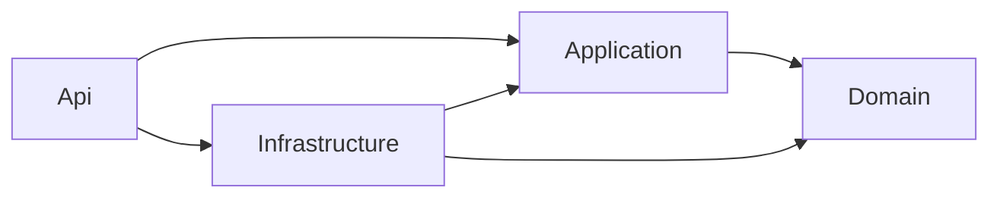

# Architecture

- `Domain` has no framework or project dependencies.
- `Application` owns contracts, permissions, pagination, and use-case boundaries.
- `Infrastructure` owns EF Core, Identity, JWT issuance, and external implementations.
- `Api` owns HTTP contracts, authentication middleware, policies, rate limits, Swagger, and health endpoints.

Architecture tests enforce these reference directions. Business entities intentionally start in Phase 3.
