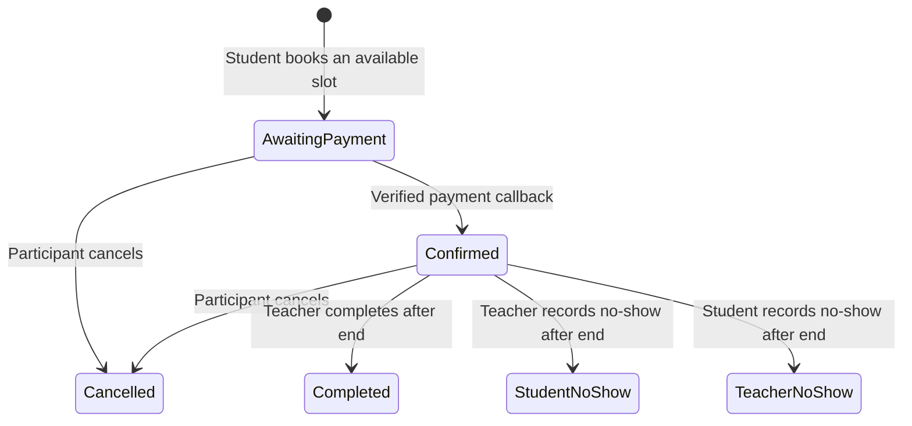

# Live Session Flow

Bookings use a direct active Teacher Service and one recurring availability rule. Start and end are stored in UTC; both participant timezone identifiers are retained. Awaiting-payment and confirmed sessions reserve the slot. Overlap checks and rescheduling execute in serializable SQL Server transactions.

Joining links are available only to the Student or Teacher for a confirmed session between the configured pre-session and post-session windows. `MockLiveSessionLinkProvider` is local-only and must be replaced for production.

Cancellation and no-show configuration is snapshotted on the booking. Phase 7 owns any resulting money movement.
