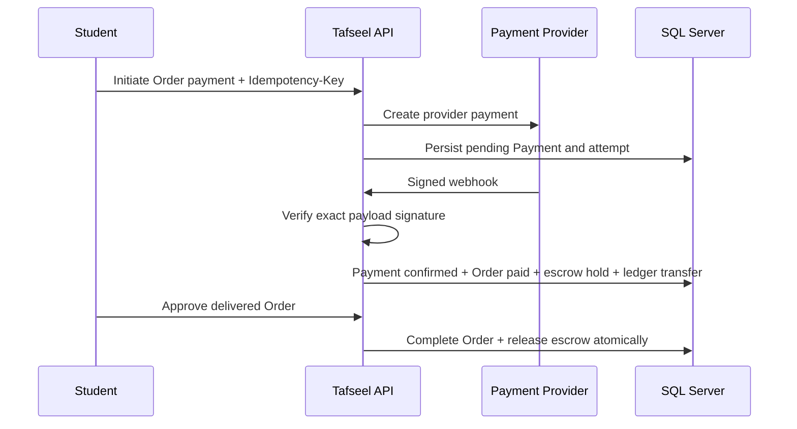

# Payment Flow

Payment success is accepted only from a verified provider callback. The Student total, fee, commission, Teacher net, and currency come from the immutable Order snapshot.

The Development/Test `MockPaymentProvider` uses an HMAC secret from User Secrets. It is rejected in Production. No card data is accepted or stored.

## Mock payment simulator (Development / explicit Staging)

When `Payments:Provider=Mock` and `Payments:Mock:SimulatorEnabled=true` (Development default):

1. Initiate returns `checkoutReference` as `/app/Tafseel-Mock-Checkout.dc.html?ref=mock_…`
2. The student chooses Success or Failure on the simulator page
3. `POST /api/v1/payments/mock/simulator/complete` signs a Mock webhook **server-side** and calls `ProcessWebhookAsync` (same verification, idempotency, escrow, and `Order.ConfirmPayment` path as a real webhook)
4. The browser never holds `Payments:WebhookSecret` and never marks the Order paid from UI state

Staging keeps `SimulatorEnabled=false` unless ops explicitly enable it. Production forbids Mock provider and the simulator.

Automatic completion and escrow release are disabled. Full refunds are allowed only before release; post-release outcomes require a dispute decision.
