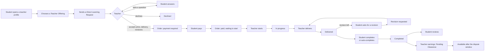
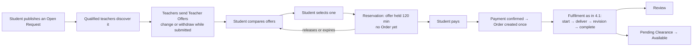
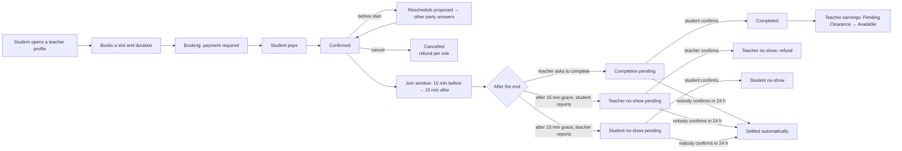
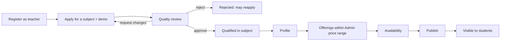

# Tafseel Product Contract

**Status:** authoritative · Release Control 1 (V1 freeze), 2026-09-15 · branch `release/rc1-v1-freeze`
from `bec03a8` (Wave 3B closed).

This is the highest-level product and business reference for Tafseel. It describes the business
model **as implemented** in the code, the tests and the browser journeys proven in Waves 1–3B.
It does not invent rules. Where the implementation and a stated product intent differ, the
difference is marked **DECISION REQUIRED** and tracked in
[`V1_RELEASE_BLOCKERS.md`](../releases/V1_RELEASE_BLOCKERS.md) (`DEC-*`).

Order of authority when documents disagree: (1) the backend domain and its tests, (2) this
contract, (3) [`V1_SCOPE.md`](./V1_SCOPE.md), (4) everything else. A change to a rule here goes
through Gate 1 of [`SDLC.md`](../engineering/SDLC.md).

Related: [V1 scope](./V1_SCOPE.md) · [V1.1 backlog](./V1_1_BACKLOG.md) ·
[UX principles](./UX_PRINCIPLES.md) · [SDLC](../engineering/SDLC.md) ·
[Production readiness](../releases/PRODUCTION_READINESS.md) ·
[Release blockers](../releases/V1_RELEASE_BLOCKERS.md) ·
[Remediation matrix](../audits/baseline-2026-09-14/REMEDIATION_MATRIX.md)

---

## 1. What Tafseel is

Tafseel is a two-sided learning-help marketplace for Arabic- and English-speaking students (Saudi
first, SAR). **Students** get explanations of their own material from **qualified teachers**, either
as asynchronous work (a recorded explanation delivered as files) or as a scheduled **live session**.
Teachers become sellable only after a **Quality Reviewer** approves them for a subject. The
platform holds the student's payment in escrow, releases it to the teacher when the work is
accepted, keeps it withdrawable only after a dispute window, and takes a fee on both sides.

---

## 2. Roles

| Role | Can | Cannot |
|------|-----|--------|
| **Visitor** | browse and filter published teachers, open a public profile with services and public reviews, read policies | request, book, message, see prices after fees |
| **Student** | request a specific teacher, publish an open request, compare and select offers, pay, message, receive deliveries, ask for revisions, complete, review, book and attend live sessions, open disputes | see other students' data, see a teacher's unpublished data, change agreed terms |
| **Teacher** | apply per subject with a demo; once approved: profile, offerings within Admin rules, availability, publication, handle direct requests, send offers on open requests, start and deliver orders, run live sessions, message, see earnings, request withdrawals | sell a subject they are not approved in, create or change a Catalog Service or its price boundaries, review their own application, confirm their own completion or no-show claim |
| **Quality Reviewer** | work the application queue, watch the demo, start a review, decide (approve / request changes / reject), moderate showcases | review their own application (`self_review_forbidden`), change catalog or money |
| **Admin** | catalog and policy governance, users (suspend), operations lists, disputes, reviews moderation, refunds, payout-profile verification and withdrawal processing, reconciliation, audit | suspend themselves, remove the last Admin |

One account may hold several roles (for example Teacher and Quality Reviewer); every rule is
enforced per action, not per account.

---

## 3. Terminology

Use these words in product, UI copy, documentation and tickets. Code names are given only to
connect the term to the implementation; **never show a code name to a user**.

### 3.1 Catalog Service
*Code: `ServiceCatalogItem`.* A platform-defined kind of work, **owned by Admin**. It defines the
name and description (Arabic and English required before it can be active), the **order type**
(`async_request` — delivered work; `live_session` — scheduled call), whether it is public and
teacher-selectable, allowed session durations (live: 30/60/90/120 min), the **price policy**
(currency SAR, minimum, maximum, default, recommended), delivery-time policy (minimum, default,
maximum hours for async), revision policy (default and maximum) and the qualification policy
(`subject_qualification_required`).

The four canonical Catalog Services created in every environment:

| Code | English | Arabic | Order type |
|------|---------|--------|------------|
| `recorded_explanation` | Recorded explanation | شرح مسجّل | asynchronous |
| `assignment_guidance` | Assignment guidance | إرشاد الواجبات | asynchronous |
| `exam_revision` | Exam revision | مراجعة الاختبار | asynchronous |
| `live_session` | Live session | جلسة مباشرة | live session |

A **Teacher never creates a Catalog Service** and never changes its definition or its boundaries.

### 3.2 Teacher Offering
*Code: `TeacherService`.* A teacher's own configuration of **one Catalog Service in one approved
subject**: title, description, price, delivery hours, included revisions, active on/off.

**Pricing rule (implemented and confirmed):**

1. Admin defines the Catalog Service's allowed **minimum** and **maximum** price.
2. The teacher chooses their price **inside that range** (`service_price_out_of_policy`
   otherwise), and delivery hours and revisions inside the Catalog Service's limits.
3. The backend is authoritative: the same check runs when an offering is created or updated
   (`MarketplaceService`), when a live session is booked, when a direct request is created and
   accepted (`OrderService`), and when an open-request offer is sent or changed
   (`OpenMarketplaceService`) — all through `ServiceCatalogPolicyValidator`.
4. The teacher cannot change the definition or the boundaries.
5. An offering can be created only in a subject the teacher holds an active approved qualification
   for (`teacher_not_approved`).

For a **live session** the offering price is an **hourly** rate: a booking costs
`price × duration ÷ 60`.

> **DECISION REQUIRED (DEC-01 — pricing boundaries).** The rule is implemented, but the canonical
> Catalog Services are created with default boundaries of **0.01–1,000,000 SAR** (asynchronous) and
> **30–1,000,000 SAR** (live). In practice there is no range until Admin sets one, and **Admin has
> no screen to edit a Catalog Service's policy** (API `PUT /admin/catalog/services/{id}` exists; UI
> does not — matrix J13-03). V1 blocker: agree real ranges and give Admin a way to set them
> (`PROD-01`).

> **DECISION REQUIRED (DEC-02 — accepted price).** When a teacher accepts a Direct Request the
> **final price** is checked against the Catalog Service range only; it may differ from the price
> on the teacher's offering (proven: an offering at 100 accepted at 150) and is not bounded by the
> student's optional budget. The student sees the accepted price before paying and can walk away.
> Confirm this is intended.

### 3.3 Learning Request
*Code: `LearningRequest`.* The student's request for work. It has a **sourcing mode**:

- **Direct Request** (`RequestSourcingMode.Direct`) — the student chose a specific teacher's
  offering and asks that teacher.
- **Open Request** (`RequestSourcingMode.OpenMarketplace`) — the student publishes a need (subject,
  asynchronous Catalog Service, title, requirements, deadline, optional budget range) without
  choosing a teacher; qualified teachers compete.

Statuses, in product words:

| Status | Product term (EN / AR) |
|--------|------------------------|
| PendingTeacherReview | Waiting for the teacher / بانتظار المعلم |
| ClarificationRequested | Teacher asked a question / المعلم لديه سؤال |
| Accepted | Accepted — order created / مقبول |
| Declined | Declined / مرفوض |
| Cancelled | Cancelled / ملغى |
| OpenForOffers | Receiving offers / يستقبل العروض |
| AwaitingPayment (open) | Offer held for payment / العرض محجوز للدفع |
| ConvertedToOrder | Became an order / أصبح طلب عمل |
| Expired | Expired / منتهي |

Rules:
- The student can cancel while Waiting for the teacher, Teacher asked a question, Receiving offers
  or Offer held for payment.
- While the request waits, the teacher may ask a clarifying question; the student's reply returns
  it to Waiting for the teacher (repeatable). The teacher may decline while it waits or after asking.
- Live-session Catalog Services cannot be requested this way (they are booked — §3.8).
- An Open Request needs an asynchronous, public, teacher-selectable Catalog Service, a future
  deadline and either no budget or both minimum and maximum (max ≥ min). The budget guides
  teachers; it does **not** cap offers.

### 3.4 Teacher Offer
*Code: `TeacherOffer`.* A **bid** a teacher sends against an Open Request: amount, delivery hours,
included revisions, validity, message. **Not the same thing as a Teacher Offering (§3.2).**

- Only teachers with an active offering for the same subject and Catalog Service see the Open
  Request and may send an offer; one offer per teacher per request.
- Amount, delivery and revisions obey the Catalog Service policy.
- A teacher sees only their own offer; competitors' offers are private.
- An offer can be changed or withdrawn only while it is *Submitted*; a withdrawn offer can be sent
  again. It cannot be changed once selected.
- Statuses: Submitted, Selected, Accepted, Withdrawn, NotSelected, Expired.

### 3.5 Selection / Reservation
The student selects one offer. Selection **reserves the Open Request for payment** of that offer
for **120 minutes** (`OpenMarketplace:OfferReservationMinutes`). It sends both the request version
and the offer version; if the offer changed since the student read it, selection is refused (409)
and the student sees the new terms.

**Selection does not create an Order.** The student can release the selection (the request
returns to Receiving offers). If the reservation expires the request reopens and the offer returns
to Submitted.

### 3.6 Order
*Code: `Order`.* The unit of asynchronous paid work between one student and one teacher, holding the
financial snapshot (price, student fee, total, teacher commission, teacher net), the agreed delivery
time and the revision allowance.

- **Direct:** the Order is created when the teacher **accepts** the request with final price,
  delivery time and revisions. It starts *Awaiting payment*.
- **Open marketplace:** the Order is created **only when payment for the reserved offer
  succeeds** (in the payment webhook), exactly once, at the offer's terms.

Order statuses (with payment status):

| Status | Payment | Product term |
|--------|---------|--------------|
| AwaitingPayment | Pending | Payment required / بانتظار الدفع |
| AwaitingPayment | Paid | Paid — waiting for the teacher to start / تم الدفع |
| InProgress | Paid | In progress / قيد التنفيذ |
| Delivered | Paid | Delivered — review it / تم التسليم |
| RevisionRequested | Paid | Revision requested / طُلب تعديل |
| Completed | Paid | Completed / مكتمل |
| Cancelled | — | Cancelled / ملغى |

Rules:
- Paying does not start the work; the **teacher starts** a paid order.
- The teacher delivers (files + note) while *In progress* or *Revision requested*; each delivery
  goes through the protected content endpoint.
- The student may ask for a **revision** only while *Delivered* and while revisions remain
  (`revision_limit_reached`).
- The student **completes** a *Delivered* order. If the student does nothing, the order
  **auto-completes** once the later of 72 hours (`Payments:AutoReleaseAfterHours`) and the 7-day
  dispute window has passed since the last delivery, unless a dispute is open.
- Either participant may cancel only before payment.
- Extensions (asking for more time) exist in the API; there is no UI in V1 (§9).

### 3.7 Payment
*Code: `Payment`.* One payment per payable (Order, Live Session Booking, or reserved Open Request),
idempotent per payable. Amount = price + **student fee 8%** (`Fees:StudentFeePercent`); the teacher
side carries a **15% commission** (`Fees:TeacherCommissionPercent`). Statuses: Pending → Confirmed
(or Failed); Refunded. On confirmation the money is **held in escrow**. Only the mock provider exists
today (§8).

### 3.8 Live Session Booking
*Code: `LiveSessionBooking`.* A scheduled one-to-one call of a live-session offering. **A separate
business entity from Order — never call it an Order.**

- Booked into a free slot of the teacher's weekly availability (30-minute steps by default),
  30/60/90/120 minutes, price = hourly offering price × duration ÷ 60 (+ optional emergency premium,
  see DEC-07).
- Statuses: Awaiting payment → Confirmed → (Completion pending → Completed) or
  (Student no-show pending → Student no-show) or (Teacher no-show pending → Teacher no-show);
  Cancelled.
- **Join** is allowed to both participants from 15 minutes before the start to 15 minutes after the
  end (`join_window_closed` otherwise); the room link comes from the meeting provider (mock today).
- **Settlement is mutual:** after the end the teacher asks to complete; after the 15-minute grace the
  teacher may report a student no-show or the student a teacher no-show; **the other party confirms**;
  if nobody confirms, the server finalizes the claim 24 hours (`SettlementReviewHours`) after the
  no-show grace ends.
- **Cancellation:** either participant while awaiting payment or confirmed. A teacher cancellation
  always refunds the student; a student cancellation refunds only if made at least 24 hours
  (`CancellationWindowHours`) before the start.
- **Reschedule:** a participant proposes a new time before the start; the other party accepts or
  declines.

### 3.9 Earnings
Money a teacher has earned lives in the ledger, not on the Order:

```
Work accepted (order completed / session completed or settled for the teacher)
  → escrow released: teacher net credited as PENDING CLEARANCE (not withdrawable)
  → the exposure (dispute) window ends: 7 days after the last delivery / after the session end
  → AVAILABLE (withdrawable)
  → Withdrawal requested (≥ 50 SAR) → Admin processes → Completed (or Rejected, money returns)
```

**Completion does not make money immediately withdrawable** while the purchase can still be
disputed. Promotion to Available is done by the earnings-maturity worker from the stored
`MaturesAt`.

> **DECISION REQUIRED (DEC-03 — late completion).** The ledger credits *Available* directly when
> the exposure window has **already ended** at completion (for example an order auto-completed 7
> days after delivery, or a student who completes more than 7 days after the last delivery). This
> is consistent with "pending only while disputable", but differs from a literal "completion always
> goes to Pending Clearance". Confirm.

### 3.10 Withdrawal and payout profile
A teacher submits a **payout profile** (legal name, country, payout method, a **masked** destination
label, last four identity characters). Admin verifies or rejects it. With a verified profile the
teacher requests a withdrawal of at least 50 SAR from Available; Admin approves (recording the
external transfer reference) or rejects, in which case the amount returns to Available. Expected
settlement: 3 business days.

> **DECISION REQUIRED (DEC-04 — how payouts are actually paid).** The platform stores only a masked
> destination, so an Admin cannot execute a bank transfer from the data Tafseel holds. Decide the V1
> payout mechanism (manual bank transfer with full details held securely, or a payout provider) and
> its compliance requirements. No teacher or Admin UI exists yet (matrix J12-02..04).

### 3.11 Refund
Admin refunds a confirmed payment **in full** with a mandatory reason (idempotent). Disputes resolve
with *Refund student*, *Release teacher* or *No financial action*; the dispute path and the ledger
decide whether money leaves escrow, pending or available balances.

> **DECISION REQUIRED (DEC-05 — refund policy).** Only full refunds exist. Decide whether V1 needs
> partial refunds and the customer-facing refund policy. No Admin refund UI exists (J14-04).

### 3.12 Dispute
Opened by a participant on a paid purchase:
- **Order, non-delivery:** student only, paid, not yet delivered, more than 24 h
  (`Orders:NonDeliveryGraceHours`) past the agreed delivery time.
- **Order, delivered work:** either participant, paid, delivered / revision requested / completed,
  within 7 days of the last delivery.
- **Live session:** either participant, after the end and within 7 days.

One dispute per purchase. Evidence and messages are private to the parties and Admin. Admin starts
review and resolves with a rationale. An open dispute stops automatic completion and settlement.

### 3.13 Review
- A student may review a **Completed and paid Order** once (`duplicate_review` otherwise), with five
  1–5 ratings (explanation clarity, subject knowledge, communication, on-time delivery, value for
  money), a required comment (≤ 2,000) and "would recommend".
- A student may review a **Completed live session** once (API only in V1 — §9).
- The overall score is the mean of the five; the teacher's public rating is the mean of visible
  reviews. Reviews are visible immediately; Admin can hide one (moderation) which removes it from the
  public rating. The public review shows score and comment, **not the student's identity**.

### 3.14 Qualification
A teacher applies per subject (wizard + demo video). Quality Reviewer: start review → nine 1–5
criteria → Approve / Request changes (teacher resubmits in place) / Reject (reapplication allowed).
Approval creates the subject qualification that makes offerings in that subject possible. A reviewer
cannot review their own application. Revocation exists in the API but has no usable read-side
identifier (§9).

### 3.15 Publication
A teacher's profile is public only when published. Publishing requires the server's readiness
checks, returned as blocking reasons (for example an approved qualification, an eligible active
offering, availability, profile language). Readiness is decided by the server, not the client.

### 3.16 Conversation and message
One conversation per business object (Order, Live Session Booking, Learning Request) between its
participants; opening it again returns the same conversation. Messages up to 4,000 characters, one
attachment each (PDF, PNG, JPEG, DOCX, PPTX, ZIP; ≤ 50 MB; signature-checked), opened only through
the protected endpoint. Delivered live over SignalR with polling fallback. Authorization is by
participation, never by knowing the id.

---

## 4. Demand paths

### 4.1 Direct Request



### 4.2 Open Request (marketplace)



### 4.3 Live Session Booking



### 4.4 Supply (teacher onboarding)



---

## 5. Fees, prices and money — current values

| Setting | Value | Where |
|---------|-------|-------|
| Student fee | 8% of price | `Fees:StudentFeePercent` |
| Teacher commission | 15% of price | `Fees:TeacherCommissionPercent` |
| Open-request reservation | 120 min | `OpenMarketplace:OfferReservationMinutes` |
| Dispute / exposure window | 7 days | `Disputes:WindowDays` |
| Auto-completion | max(72 h, dispute window) after last delivery | `Payments:AutoReleaseAfterHours` |
| Non-delivery dispute grace | 24 h after agreed delivery | `Orders:NonDeliveryGraceHours` |
| Minimum withdrawal | 50 SAR | `Withdrawals:MinimumAmount` |
| Live join window / no-show grace | 15 min / 15 min | `LiveSessions` |
| Live cancellation refund window | 24 h | `LiveSessions:CancellationWindowHours` |
| Live settlement auto-finalize | 24 h | `LiveSessions:SettlementReviewHours` |
| Emergency premium | 50% | `LiveSessions:EmergencyPremiumPercent` |

> **DECISION REQUIRED (DEC-06 — fees).** Confirm the commercial values: 8% student fee and 15%
> teacher commission, charged together.

> **DECISION REQUIRED (DEC-07 — emergency premium).** The booking API accepts a client-supplied
> `emergency` flag that adds 50%, but the server defines no rule for what qualifies and the slot API
> never marks a slot as emergency, so the client never offers it. Decide the rule, or disable the
> premium for V1.

> **DECISION REQUIRED (DEC-08 — VAT and invoicing).** The code has no VAT, tax or invoice concept.
> Confirm the Saudi tax and e-invoicing obligations for the launch entity before real payments.

---

## 6. What each role must see (V1 intent)

Summary; the detailed inventory and the proposed navigation are in
[`UX_PRINCIPLES.md`](./UX_PRINCIPLES.md).

- **Student:** find a teacher, post a request, what needs my action now (pay, review a delivery,
  answer a question, confirm a session), current requests, current orders, upcoming session,
  messages. Not: raw lists of every entity, statuses as codes, settings on the home.
- **Teacher:** what needs action (new direct requests, orders to start or redeliver, sessions to
  settle), relevant open opportunities, upcoming session, publication blocker while unpublished,
  earnings summary (after `FIN-01`). Setup (profile, offerings, availability, qualifications) as
  configuration areas, not home content.
- **Quality Reviewer:** the application queue and the review screen. Showcase moderation only if
  showcases launch.
- **Admin:** only launch-critical operations: attention list, users (suspend), catalog and price
  boundaries, disputes, refunds, payout verification and withdrawals, reconciliation, audit.

---

## 7. Authorization principles (implemented)

- Every action is authorized on the server from the resource's participants and the actor's role;
  the id in an address is never a credential. Non-participants get **404**, wrong-role actors
  **403**, state violations **400/409** with a stable `code`.
- Every state-changing call carries the version it read (`If-Match`); stale versions fail with 409.
  Money-starting calls carry an `Idempotency-Key`.
- Files (request attachments, deliveries, message attachments, session files, demos) are streamed
  only through authorized content endpoints; storage keys and container URLs are never exposed.
- The strict API contract gate (`scripts/ci/check-api-contract.mjs --strict`) is a permanent,
  zero-violation gate.

---

## 8. Providers

| Capability | Today | Production rule |
|------------|-------|-----------------|
| Payments | Mock provider + simulator (Development/Staging) | Production refuses `Payments:Provider=Mock` and the simulator; a real `IPaymentProvider` must be registered |
| Meetings | Mock link provider | Production refuses the mock; Zoom / Google Meet / Microsoft Teams adapter must be registered |
| Payouts | none (manual Admin processing) | DEC-04 |
| Files | Local (dev) / Azure Blob private container | Production requires Azure Blob |
| Email | Resend | verified sending domain required |
| AI assistant | Groq, `Ai.Enabled` off outside Development | optional |

---

## 9. Known intentional gaps (confirmed 2026-09-15)

Recorded so they are not rediscovered by every audit. Each has a backlog or blocker entry.

| Gap | Current state (verified) | Tracked |
|-----|--------------------------|---------|
| Qualification revoke UI | `POST /teacher-qualifications/{id}/revoke` needs a qualification id; no read endpoint returns one (`OperationalQualifiedSubjectDto` carries the subject id only) | V1.1 `B11-01` |
| Live-session review | `POST /live-sessions/{bookingId}/review` works; no UI | V1.1 `B11-02` |
| Order extensions | API exists; UI intentionally not built | V1.1 `B11-03` |
| Teacher setup ordering | `GET /teachers/me` returns an empty profile until "About you" is saved; the editor shows the lists after that first save | V1.1 `B11-04` (UX copy only) |
| Docker image CI (G-20) | never built; Docker not installed locally, nothing pushed | blocker `INF-01` |
| Credential rotation | seed/UAT password in pushed history; four staging host secrets | blockers `SEC-01`, `SEC-02` |
| Real providers | payments, meetings, payouts not implemented | `PAY-*`, `MEET-01`, `DEC-04` |
| Money-out / admin finance UX | balance rendered by the generic list; no payout profile, withdrawal, admin payout or refund screens | `FIN-*` |
| Coupons | admin coupon list exists, toggle broken (J13-04); **no coupon field in checkout**, while the landing promo shows codes | DEC-09, `UX-07` |
| Emergency premium | API flag only (DEC-07) | DEC-07 |
| VAT / invoices | absent | DEC-08 |

---

## 10. Proven behaviours that must not regress

From the Wave 3B journeys (fresh database, published build):

- Direct: request → accept → payment → start → messages → deliver → revision → redelivery → complete
  → review, with the visitor seeing the new rating.
- Open marketplace: open request → offers (send, change, withdraw) → compare → select (stale version
  refused) → reservation → payment → **one** order. Selection never creates the order; payment does.
- Messaging: SignalR delivery without reload, polling fallback, one conversation per object,
  protected attachments.
- Live session: separate from Order; join window enforced by the server; mutual completion and
  no-show settlement.
- Completion puts earnings into Pending Clearance while the dispute window is open.
- The protected financial and domain code (`Tafseel.Domain`, `FinancialService`, ledger, escrow,
  maturity, idempotency, reconciliation, migrations) stays authoritative and changes only for a
  demonstrated defect with a test.
