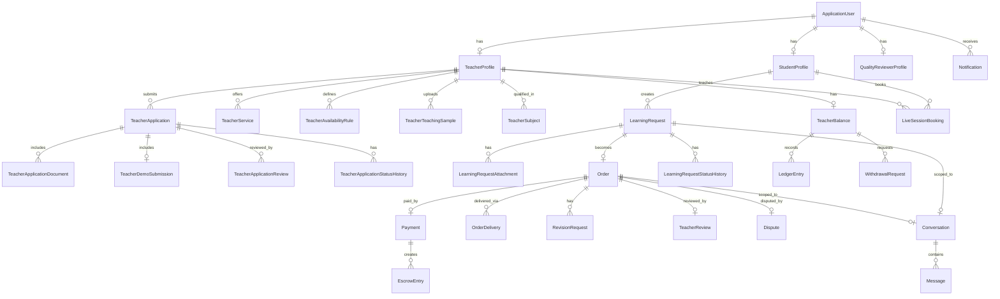

# Proposed Domain Model

> Pass 3 implementation note (2026-07-26): the implemented catalog and teacher-qualification model is authoritative where it differs from this broader Phase 1 proposal. Catalog records now persist display `Name` and product-normalized `NormalizedName`. Subjects, Education Levels, Teaching Languages, and Service Catalog Items are globally unique by normalized name; Topics and Qualification Topics are unique by `(SubjectId, NormalizedName)`. `TeacherApplication.RowVersion` is exposed as an opaque API version, and historical reviews, scores, and status rows use restrictive delete behavior. Future marketplace aggregates below remain proposals and were not implemented in Pass 3.

Derived from [frontend-requirements-audit.md](frontend-requirements-audit.md). This is a **proposal for Phase 2+**; nothing here has been implemented yet. Field lists are illustrative, not exhaustive column-by-column specs — those get finalized during Phase 2/3 EF Core configuration.

Mermaid overview (major aggregates only — full field-level ERD belongs in `docs/domain-model.md` once implemented):

## 1. Identity & Profiles

- **ApplicationUser** (Identity) — email, password hash, phone (optional), roles, security stamp, email-confirmed flag, account status (`Active|Suspended|PendingVerification`), created/last-login timestamps. *Suspension observed as an Admin action on every user row — [audit §3.7](frontend-requirements-audit.md#37-admin-dashboard-tafseel-admin-dashboarddchtml).*
- **StudentProfile** (1:1 ApplicationUser) — display name, education level, preferred language(s), avatar file reference.
- **TeacherProfile** (1:1 ApplicationUser) — bio, years of experience, city/country, teaching languages, verification status, "level" badge (`Verified|RisingTalent|TopRated` — flagged as ambiguous, see [business-ambiguities.md](business-ambiguities.md) §5), response-time (computed, cached), rating (computed, cached), avatar, LinkedIn URL, bank payout reference (masked in UI — [Teacher-Dashboard:348](../Tafseel-Teacher-Dashboard.dc.html#L348)), timezone.
- **QualityReviewerProfile** (1:1 ApplicationUser) — notification preferences (new-application email, auto-assign toggle — [Quality-Dashboard:386-387](../Tafseel-Quality-Dashboard.dc.html#L386-L387)).
- **Language**, **EducationLevel** — reference/lookup tables (soft-deactivatable), not enums, since Admin manages them via catalog pages.

## 2. Academic Catalog

- **Subject** — name, icon, active flag ([Admin catalog, Subjects tab](../Tafseel-Admin-Dashboard.dc.html#L399-L405)).
- **Topic** — subject FK, name, difficulty, active flag. Distinguish from **QualificationTopic** (a topic an applicant records their demo against — [Quality-Dashboard demoTopic](../Tafseel-Quality-Dashboard.dc.html#L271)) which may be a curated subset admins maintain for applications specifically ([Admin catalog, Topics tab](../Tafseel-Admin-Dashboard.dc.html#L407-L411) uses application-style topic names, e.g. "Factoring quadratics using the box method").
- **EducationLevel** — High school / Undergraduate / Postgraduate / Professional (closed set observed consistently everywhere).
- **TeacherSubject** (join: TeacherProfile × Subject) — represents subject-specific approval; a teacher approved for Physics is not automatically approved for Chemistry (per spec, and no UI evidence contradicts it).
- **TeacherTopic** (join: TeacherProfile × Topic) — the "Subjects & topics" chip list on the profile page.
- **ServiceCatalogItem** — the admin-managed master list of service types (Custom recorded explanation, Live session, Exam revision, Assignment guidance, Project mentoring, Exam-night emergency — [Admin catalog, Services tab](../Tafseel-Admin-Dashboard.dc.html#L413-L419)), active flag, applicable-subjects scope ("Available on 4 subjects").
- **Coupon** / **CouponRedemption** — admin-managed (name, discount type/value, expiry, active flag); **no redemption UI exists anywhere in the student flow** — flagged in ambiguities.

## 3. Teacher Application & Qualification

- **TeacherApplication** — applicant (TeacherProfile FK, pre-approval so this may reference ApplicationUser directly until approved), subject(s) applied for, city, years of experience, degree, education levels served, languages, status (`Draft|Submitted|UnderReview|ChangesRequested|Approved|Rejected|Withdrawn`), priority (`High|Medium|Low` — [Quality-Dashboard priority tags](../Tafseel-Quality-Dashboard.dc.html#L295)), submitted-at, assigned-reviewer FK.
- **TeacherApplicationSubject** — one application can, per spec, be evaluated per-subject; current mock shows one subject per application, so this join table anticipates future multi-subject applications without breaking the single-subject case.
- **TeacherApplicationDocument** — degree certificates etc. (implied by "Degree" fact field; no upload UI shown, but required by spec).
- **TeacherDemoSubmission** — the qualification video: file reference, topic (QualificationTopic FK), duration, format, max-duration-seconds business rule (**180s**, observed constant — [Quality-Dashboard:187](../Tafseel-Quality-Dashboard.dc.html#L187)).
- **TeacherApplicationReview** — reviewer FK, per-criterion scores (see `TeacherEvaluationScore`), overall score snapshot, comment (shared with teacher), internal notes (never shared), decision, decided-at.
- **TeacherEvaluationScore** — application-review FK, criterion (enum, 9 fixed values from [Quality-Dashboard:268](../Tafseel-Quality-Dashboard.dc.html#L268)), score 1–5.
- **TeacherApplicationStatusHistory** — application FK, actor FK, previous status, next status, note, timestamp. Directly evidenced by the "Application history" timeline ([Quality-Dashboard:428-432](../Tafseel-Quality-Dashboard.dc.html#L428-L432)).

Business rules carried from the audit: comment required to Reject/Request-changes; approval gated per subject; **do not** compute the pass/fail decision purely from the mean of the 9 rubric scores — the frontend only *displays* the mean, the actual approve/reject action is an independent reviewer decision (buttons are separate from the score display). This must be confirmed — see [business-ambiguities.md](business-ambiguities.md) §4.

## 4. Teacher Marketplace

- **TeacherService** — teacher FK, ServiceCatalogItem FK, price (decimal), delivery-time descriptor, revision count, active flag. ("My Services" toggle list.)
- **TeacherTeachingSample** — teacher FK, video file reference, title, duration, topic/meta, display order.
- **TeacherAvailabilityRule** — recurring weekly pattern (day-of-week + time-of-day slots + timezone) — needed to reconcile the two conflicting availability UIs (see [audit §5.3](frontend-requirements-audit.md#5-inconsistencies-found-between-pages)); resolve to the richer (per-slot) model since that is what the public profile actually renders.
- **TeacherAvailabilityException** — one-off overrides (holiday, already-booked slot).
- **FavoriteTeacher** — student FK, teacher FK (the heart/save toggle on Browse and Profile pages).
- **TeacherCertification**, **TeacherExperience** — the "Education & experience" timeline entries (degree/lecturer role/certification/tutoring-start, each with a date range and icon).

Computed-not-persisted values per spec guidance: `rating` (avg of TeacherReview scores), `completedRequestsCount`, `responseTimeMinutes` (rolling average of accept/decline latency) — cache these, don't treat as source of truth.

## 5. Student Learning Requests & Orders

Per spec guidance, **do not conflate** request lifecycle, payment status, delivery status, and dispute status into one enum. Proposed split:

- **LearningRequest** — student FK, teacher FK, ServiceCatalogItem FK, title, subject/topic, description, education level, difficulty, explanation language, urgency tier (`Standard|Fast|BeforeExam|SameDay`, each with a **snapshot** fee % taken from platform config at submit time), preferred delivery date, budget (or `IsFlexibleBudget=true`), status:
  `PendingTeacherReview | ClarificationRequested | Accepted | Declined | Cancelled` (request-side only — payment/delivery move to Order once accepted).
- **LearningRequestAttachment** — request FK, file reference, original name, size, content-type, uploaded-at.
- **LearningRequestStatusHistory** — mirrors TeacherApplicationStatusHistory pattern.
- **Order** — created on acceptance; request FK, teacher FK, student FK, **finalPrice** (teacher-set at accept time, from the Accept modal), **agreedDeliveryDate**, **revisionsAllowed**, teacher notes, a **financial snapshot** of platform-fee/commission-rate at acceptance time (per spec: "store financial snapshots on accepted orders"), status:
  `AwaitingPayment | Paid | InProgress | ReadyForDelivery | Delivered | RevisionRequested | Completed | Cancelled | Refunded`.
- **OrderDelivery** — order FK, file references, teacher notes, delivered-at, revision-number (0 = first delivery).
- **RevisionRequest** — order FK, student FK, reason, requested-at, resolved-at.
- Concurrency token on `Order.Status` (optimistic) — students/teachers/admin/dispute-resolution can all attempt transitions.

## 6. Live Sessions

- **LiveSessionBooking** — student FK, teacher FK, subject/topic label, duration (30/60/90/120 min per spec; frontend only shows 60/90/120 — reconcile in Phase 6), scheduled-start-UTC, student timezone, teacher timezone, status (`Scheduled|Rescheduled|Cancelled|Completed|NoShowStudent|NoShowTeacher`), price, joining-link reference (abstraction — no real video vendor is wired up anywhere in the frontend, "Opening session room…" is a stub).
- **TeacherAvailabilitySlot** — materialized bookable slots derived from `TeacherAvailabilityRule` minus existing bookings/exceptions; used to prevent double-booking at the DB/transaction level (unique constraint on teacher+start-time-range or exclusion constraint).
- **LiveSessionAttachment** — optional, symmetrical with LearningRequestAttachment.
- **LiveSessionStatusHistory**.

There is currently no frontend page that actually books a session end-to-end — the Teacher-Profile "Availability" tab only "holds" a slot with a toast, and the Request wizard never asks for a specific slot even when "Live explanation" is chosen. This gap is flagged in ambiguities; the domain model above still follows the spec because live sessions are clearly a first-class concept (dashboards on both sides manage them).

## 7. Messaging

- **Conversation** — scoped to exactly one of {LearningRequest, Order, LiveSessionBooking} (nullable FKs, exactly one non-null via check constraint), or a general pre-request inquiry (teacher-profile "Contact teacher" link) — participant list.
- **ConversationParticipant** — conversation FK, user FK, joined-at, last-read-at (drives unread counts/badges seen on both dashboards).
- **Message** — conversation FK, sender FK, body, sent-at.
- **MessageAttachment** — message FK, file reference.
- **MessageReadReceipt** — or fold into `ConversationParticipant.last-read-at` if per-message receipts aren't needed (no UI evidence of per-message read receipts, only unread *conversation* dots).

Chat is implemented as a shared dashboard widget using the existing conversation/message APIs and SignalR hub.

## 8. Notifications

- **Notification** — user FK, type (enum matching [audit §7](frontend-requirements-audit.md#7-notification-events-evidence-based)), title, body, related-entity type/id, read flag, created-at.
- **UserNotificationPreference** — per-user toggles observed: student (email on new deliveries, email on session reminders), teacher (email on new requests, SMS on session reminders), reviewer (email on new application, auto-assign).
- **NotificationTemplate** — optional, only if templating value is clear; the mock strings are simple enough that this may be over-engineering for Phase 8 — decide then.

## 9. Reviews & Ratings

- **TeacherReview** — order FK (unique — one review per completed+paid order), student FK, teacher FK (denormalized for query convenience), overall score, written comment, recommend flag, created-at.
- **ReviewScore** — review FK, category (`Clarity|Communication|SubjectKnowledge|DeliveryTime|ValueForMoney` — the 5 fixed categories from the profile page), score 1–5.
- **ReviewModerationRecord** — review FK, moderator FK, action (`Flagged|Unflagged|Removed`), reason, timestamp. (Admin's Reviews list shows a "Flagged" status on one mock row — [Admin-Dashboard:444](../Tafseel-Admin-Dashboard.dc.html#L444).)

Kept entirely distinct from `TeacherApplicationReview`/`TeacherEvaluationScore` above (different purpose, different rubric, different actors) per [audit §5.2](frontend-requirements-audit.md#5-inconsistencies-found-between-pages).

## 10. Payments, Escrow, Ledger, Withdrawals

- **Payment** — order FK, amount, currency (`SAR` fixed for now, stored explicitly per spec), provider transaction reference, status (`Pending|Succeeded|Failed|Refunded`), idempotency key.
- **EscrowEntry** — payment FK, amount held, status (`Held|Released|Refunded`), released-at, released-by (system/admin/dispute-decision).
- **PlatformFee** — a **versioned config snapshot**, not a live-read setting: `{effectiveFrom, studentFeePercent, teacherCommissionPercent}`. This directly resolves the 8%-vs-15% inconsistency: they are two *different* fees (a student-facing "platform fee" added at request time, and a teacher-facing "commission" deducted at payout time), each independently configurable, each snapshotted onto the Order at acceptance time so later admin changes never alter historical orders. Confirm with business — see ambiguities §2.
- **TeacherBalance** — teacher FK, available amount, pending amount (denormalized/cached — must equal the sum of unconsumed LedgerEntry rows; never written directly).
- **LedgerEntry** — append-only: teacher FK (nullable for platform-only entries), order FK (nullable), type (`EscrowRelease|Commission|Withdrawal|Refund|CouponAdjustment`), amount (signed decimal), balance-after (optional denormalization), created-at, idempotency key.
- **WithdrawalRequest** — teacher FK, amount, payout-method reference (masked bank ref), status (`Requested|Processing|Completed|Failed`), requested-at, processed-at, processed-by.
- **Refund** — order FK, amount, reason, status (`Requested|Approved|Rejected|Completed`), idempotency key.
- **Currency** modeled as an explicit column (`char(3)`, default `SAR`) everywhere money is stored, per spec, even though only one currency is observed today.

## 11. Disputes

- **Dispute** — order FK, opened-by FK, counterpart FK, reason, amount-in-question, status (`Open|UnderReview|Resolved|Rejected`), opened-at.
- **DisputeMessage** — dispute FK, sender FK, body, timestamp (separate thread from order Conversation, since disputes may involve admin/support who aren't order participants).
- **DisputeEvidence** — dispute FK, file reference, uploaded-by.
- **DisputeDecision** — dispute FK, decided-by (admin) FK, outcome (`RefundStudent|ReleaseToTeacher|PartialRefund|NoAction`), amount, notes, decided-at — must produce LedgerEntry rows transactionally.
- **DisputeStatusHistory**.

The Admin dashboard currently only *displays* open disputes with no resolve action — the entities above are needed regardless, since the spec requires dispute handling and the read-only list is clear evidence disputes are tracked platform-wide.

## 12. Audit

- **AuditLogEntry** — actor FK, action (string enum/const), entity-type, entity-id, timestamp, correlation-id, before/after summary (JSON, redacted of secrets), IP, user-agent. Written for: user suspend/activate, role/permission changes, teacher application decisions, subject/catalog changes, payment verification, refunds, escrow release, withdrawal processing, dispute decisions, platform-settings changes (commission rate, maintenance mode, require-review toggle — all three directly observed in Admin Platform Settings).

## 13. Explicitly out of scope for the domain model (no frontend evidence)

- Fine-grained per-message read receipts beyond conversation-level unread dot.
- Coupon redemption workflow (catalog exists, redemption path does not).
- Any real video-conferencing entity beyond an opaque "joining link" reference.
- Malware-scan result entity (spec asks for an extension point only).
