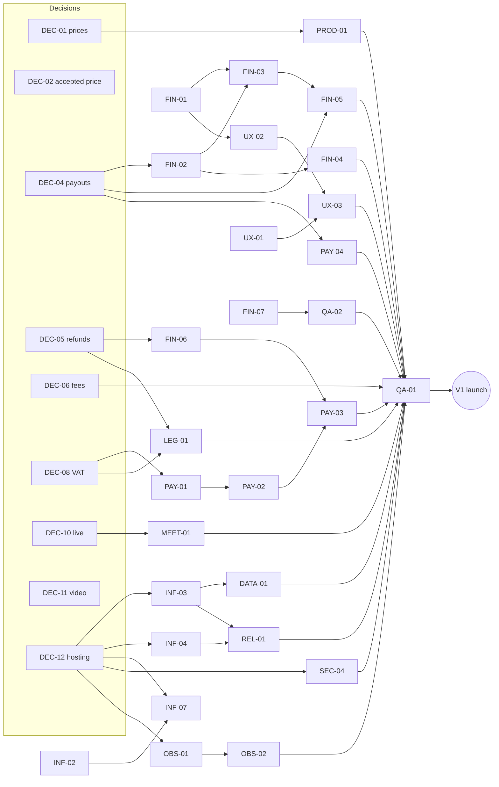
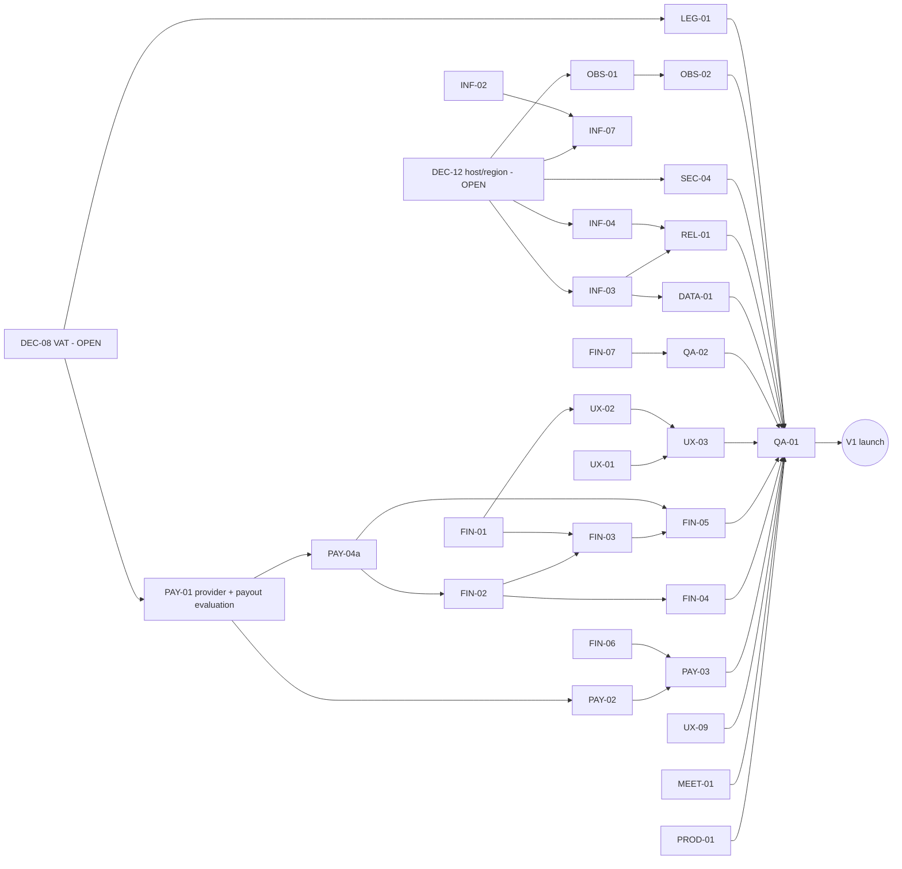

# Tafseel V1 — Owner Decision Pack

**Release Control 2 · 2026-09-15 · branch `release/rc2-owner-decisions` from `8b38920`.**
Status of each decision: [`V1_OWNER_DECISIONS.md`](./V1_OWNER_DECISIONS.md). Tickets:
[`V1_RELEASE_BLOCKERS.md`](./V1_RELEASE_BLOCKERS.md). Rules: [Product Contract](../product/TAFSEEL_PRODUCT_CONTRACT.md).

This pack prepares the nine V1-blocking owner decisions. **Every "Recommendation" below is a
recommendation, not a decision.** On 2026-09-15 the Product Owner **decided DEC-01, DEC-02, DEC-04, DEC-05,
DEC-06, DEC-10 and DEC-11** (each card carries its status); **DEC-08 and DEC-12 remain OPEN**. The
post-decision dependency recalculation is at the end of this document. **DEC-13** (listed price reference) was raised in
Release Control 3 and decided the same day (Option A) — see the addendum at the end. Nothing here changes code or configuration. Facts are taken from the
repository at `8b38920`; anything that needs market, provider, legal or tax input is marked
**EXTERNAL INPUT REQUIRED**.

Card structure: 1 current behaviour · 2 why it matters · 3 options · 4 recommendation · 5 product impact ·
6 technical impact · 7 financial/security/legal impact · 8 tickets unblocked · 9 document changes ·
10 external input required.

---

## DEC-01 — Catalog Service price boundaries

> **Status: DECIDED — Option B, with the proposed ranges and delivery/revision policy** (Product Owner, 2026-09-15). Recorded in
> [`V1_OWNER_DECISIONS.md`](./V1_OWNER_DECISIONS.md#dec-01--catalog-service-price-boundaries). The analysis below is kept as the record of the
> options considered.

**1. Current implemented behaviour.** Admin owns each Catalog Service's commercial policy
(`ServiceCatalogItem`: `MinPrice`, `MaxPrice`, `DefaultPrice`, `RecommendedPrice`, delivery hours,
revisions, durations). The teacher sets their own offering price inside it; `ServiceCatalogPolicyValidator`
enforces it on offering create/update, direct request create/accept, open-request offers and live
booking. The canonical items were created (constructor defaults and migration
`20260801135831_MarketplaceServiceCatalogRelease1`) with the values below; an existing non-zero
`MinPrice` in a database was kept, so **a given environment may differ** — the production values must be
read from its database before launch. Database constraints require `0 < Min ≤ Default ≤ Max` and
`Min ≤ Recommended ≤ Max`; async delivery hours 1–8760; revisions 0–20.

| Service | Kind | Current min / max | Default / recommended | Delivery policy (min / default / recommended / max h) | Revisions (default / max) | Durations |
|---------|------|-------------------|-----------------------|--------------------------------------------------------|---------------------------|-----------|
| `recorded_explanation` | async, per order | 0.01 / 1,000,000 | 120 / 120 | 1 / 48 / 48 / 8,760 | 2 / 20 | — |
| `assignment_guidance` | async, per order | 0.01 / 1,000,000 | 120 / 120 | 1 / 48 / 48 / 8,760 | 2 / 20 | — |
| `exam_revision` | async, per order | 0.01 / 1,000,000 | 120 / 120 | 1 / 48 / 48 / 8,760 | 2 / 20 | — |
| `live_session` | **hourly** rate; booking = rate × minutes ÷ 60 | 30 / 1,000,000 | 120 / 120 | — | 0 / 0 | 30, 60, 90, 120 |

The Admin UI can enable/disable a service but cannot edit this policy (API
`PUT /admin/catalog/services/{id}` exists; no screen — `PROD-01`).

**2. Why it matters.** A 0.01–1,000,000 range is no policy: it permits prices below the payment
provider's per-transaction cost, prices that look like errors or abuse, and very large exposure per
dispute. The range also drives the teacher's pricing guidance and the open-marketplace offer limits.

**3. Options.**
- A. Keep the current ranges (no commercial policy).
- B. Set one conservative range per service now; Admin adjusts later through `PROD-01`.
- C. Set ranges per service **and** per subject or education level (not supported by the model).

**4. Recommendation (not decision): B**, with these **starting ranges, to be validated** (see 10):

| Service | Suggested min / max (SAR) | Default / recommended | Delivery (min / default / max h) | Revisions (default / max) | Reasoning |
|---------|---------------------------|-----------------------|----------------------------------|---------------------------|-----------|
| `recorded_explanation` | 50 / 800 | 120 / 120 | 12 / 48 / 336 | 2 / 5 | Keeps today's 120 default; a floor above provider and withdrawal economics (teacher net at 50 = 42.50, and withdrawals start at 50); a ceiling that caps single-dispute exposure; 14-day maximum keeps orders inside a realistic support horizon instead of a year |
| `assignment_guidance` | 60 / 1,000 | 150 / 150 | 24 / 72 / 336 | 2 / 3 | Guidance through an assignment usually needs more back-and-forth than one explanation; fewer revisions because coaching is iterative by messages |
| `exam_revision` | 80 / 1,500 | 200 / 200 | 24 / 72 / 240 | 1 / 3 | Broader scope (syllabus, past papers); exams are date-bound, so a shorter maximum |
| `live_session` (per hour) | 60 / 600 per hour | 150 / 150 per hour | — | 0 / 0 | A 30-minute session at the floor costs 30 SAR; hourly framing matches the booking formula; revisions stay 0 by constraint |

**5. Product impact.** Teachers see a meaningful range and guidance; open-request offers and direct
acceptances are bounded; students see coherent prices across teachers. Offerings already outside the new
range become non-compliant (the model already computes `isCompliant`), so their teachers must reprice.

**6. Technical impact.** Values are data, not code: they are applied through the existing API or
`PROD-01`. No migration needed (the check constraints already accept these values). The delivery
maximum change affects the latest possible `AgreedDeliveryAt` and so the non-delivery dispute timing.

**7. Financial / security / legal.** Floors must cover provider fees (unknown); ceilings cap refund and
dispute exposure and reduce misuse risk. Prices are SAR; VAT inclusion is DEC-08.

**8. Tickets unblocked.** `PROD-01` (Gate 1). Also informs `LEG-01` (price display) and `QA-01`.

**9. Document changes.** Product Contract §3.2: replace the DEC-01 note with the approved table and state
"live-session price is an hourly rate". V1_SCOPE §10 "Catalog Service policy editing" stays MUST.

**10. EXTERNAL INPUT REQUIRED.** Saudi market price research per service and education level; payment
provider fee schedule (fixed + percentage) to set floors; whether any subject (e.g. university vs school)
needs a different range — the model has one range per Catalog Service only; confirmation of the current
values in the staging and future production databases.

---

## DEC-02 — Direct-request accepted price

> **Status: DECIDED — Option B; budget remains guidance; UX-09 created** (Product Owner, 2026-09-15). Recorded in
> [`V1_OWNER_DECISIONS.md`](./V1_OWNER_DECISIONS.md#dec-02--direct-request-accepted-price). The analysis below is kept as the record of the
> options considered.

**1. Current implemented behaviour.** On acceptance the teacher sends `finalPrice`, `currency`,
`agreedDeliveryAt`, `revisionAllowance` (`POST /learning-requests/{id}/accept`, If-Match, Idempotency-Key).
`EnsureAcceptedTerms` checks the price against the **Catalog Service range only**, the delivery hours
against the catalog delivery policy and revisions against the maximum. The accept dialog **pre-fills the
offering's price** (Wave 2 journey: 100 shown), but the teacher may change it (Wave 3B journey accepted at
150 over a 100 offering). The student's `budget` on the request is optional and not enforced. The Order is
created at the accepted price; the student sees price, fee and total on the order screen and at checkout
and **pays only if they agree**; an unpaid order can be cancelled by either participant.

**2. Why it matters.** A student chooses a teacher partly by the listed price; a silently higher price
at acceptance can feel like bait-and-switch, while a rigid price prevents fair adjustment for larger work
discovered after reading the brief.

**3. Options.**
- A. Accepted price must equal the Teacher Offering price.
- B. Teacher may propose another price inside the Admin range; the student explicitly accepts by paying
  (the current behaviour).
- C. Teacher may change the price but not above the student's stated maximum budget.

| | A. Equal to offering | B. Negotiable within range (current) | C. Capped by student budget |
|---|---|---|---|
| Student trust | highest | depends on clear disclosure | high when a budget is given |
| Fits scope changes | no | yes | partly |
| Code change | yes (validation + dialog) | none | yes (validation, and budget semantics) |
| Edge cases | teachers decline instead of adjusting | surprise price if not highlighted | no budget given → falls back to A or B |

**4. Recommendation (not decision): B**, plus disclosure: the order and checkout screens must state
clearly when the agreed price differs from the listed price (a UX ticket, see 8). **The budget stays
guidance, not a hard constraint**, because (a) it is optional, so a cap would apply to some requests and
not others; (b) the student already has the decisive control — nothing is charged until they pay the
final total; (c) on open requests the budget is already guidance for offers, and the two paths should
behave the same.

**5. Product impact.** Negotiation stays possible; the disclosure makes it visible. Clarifying questions
remain the way to agree scope before a price change.

**6. Technical impact.** Option B: no backend change; a small UX ticket to show "listed price → agreed
price" on the request/order/checkout screens. Option A or C: validation change in `OrderService.AcceptAsync`
(protected order path; needs tests) and accept-dialog change.

**7. Financial / security / legal.** Consumer-protection expectations about advertised prices in Saudi
Arabia are **EXTERNAL INPUT REQUIRED**; B is defensible only with clear disclosure before payment.

**8. Tickets unblocked.** No existing blocker waits on DEC-02. Result: B → new ticket `UX-09 — Show when
the agreed price differs from the listed price` (S, blocker candidate); A or C → new ticket
`ACC-01 — Enforce accepted price rule` (M).

**9. Document changes.** Product Contract §3.2: replace the DEC-02 note with "The teacher may accept at a
price different from their offering, inside the Catalog Service range; the budget is guidance; the student
agrees by paying; screens disclose a changed price." `V1_RELEASE_BLOCKERS.md`: add UX-09 (or ACC-01).

**10. EXTERNAL INPUT REQUIRED.** Legal view on advertised-price vs final-price disclosure for consumers.

---

## DEC-04 — Teacher payout mechanism

> **Status: DECIDED — Option C; PAY-01 evaluates Moyasar and Tap Payments payout capabilities first; PAY-04 split into PAY-04a / PAY-04b** (Product Owner, 2026-09-15). Recorded in
> [`V1_OWNER_DECISIONS.md`](./V1_OWNER_DECISIONS.md#dec-04--teacher-payout-mechanism). The analysis below is kept as the record of the
> options considered.

**1. Current implemented behaviour.**
- **Earnings:** ledger accounts `TeacherPending` → `TeacherAvailable` by the maturity worker after the
  7-day exposure window.
- **Payout profile** (`TeacherPayoutProfile`): legal name, 2-letter country, `PayoutMethod` (free text ≤ 30),
  **masked** `DestinationLabel` (the domain requires masking characters), last four identity characters;
  Admin verifies or rejects (`POST /admin/payout-profiles/{teacherId}/review`).
- **Withdrawal:** teacher requests ≥ 50 SAR from Available with a verified profile
  (`verified_payout_profile_required`, `withdrawal_below_minimum`); money moves to a pending-withdrawal
  account; Admin **approves with a mandatory `ProviderReference`** or rejects (funds return to Available);
  audited; notifications sent. Reconciliation reports pending withdrawals.
- **No `IPayoutProvider`** abstraction exists; no automated transfer; no full bank details are stored.
- No teacher or Admin screens (FIN-01…05).

**2. Why it matters.** Teachers must be paid on time and accurately; the platform must not store bank data
insecurely, and every transfer must be traceable to a ledger entry for reconciliation and audit.

**3. Options.**
- A. Controlled manual bank transfer for V1.
- B. Automated payout provider from day one.
- C. Hybrid: an `IPayoutProvider` port with a **manual, audited adapter** in V1; an automated adapter later.

| Criterion | A. Manual | B. Automated provider | C. Hybrid |
|-----------|-----------|-----------------------|-----------|
| Saudi launch fit | works with any bank relationship | depends on a provider supporting SAR payouts to local banks | works now; provider when ready |
| Operational workload | high per withdrawal (bank portal entry, reference capture) | low | high at first, drops when the adapter changes |
| Bank data / security | full destination (IBAN) must exist **somewhere** the operator can use; today Tafseel holds only a mask | provider tokenizes bank details | manual adapter needs a secure place for full details (see 6) |
| Audit trail | Admin approval + reference already audited | provider events + webhooks | same as A, plus adapter events |
| Payout references | typed in by Admin (already required) | returned by provider | adapter returns or Admin enters |
| Reconciliation | against bank statement, manual | against provider reports, automatable | manual first |
| Provider dependency | none | high; onboarding and KYC | none at launch |
| Launch speed | fastest | slowest (integration + onboarding) | fast |
| Dead-end risk | high if built directly into Admin UI | none | none |

**4. Recommendation (not decision): C.** The smallest safe V1 architecture:
1. An `IPayoutProvider` port (initiate, get status) used by withdrawal processing, with a
   `ManualBankTransferPayoutProvider` whose "initiate" records an operator task and whose completion is the
   Admin entering the bank reference — the ledger path already implemented stays unchanged.
2. **Full bank details are not stored in the Tafseel database in plain form.** Either (a) collected and
   held by the payment/payout provider or bank portal (Tafseel keeps the mask and a provider token), or
   (b) if they must be held by Tafseel, stored encrypted with a key in the secret store and visible only to
   a dedicated finance permission, with access audited. (a) is preferred.
3. Dual control for approval above a threshold, a daily payout batch, and a reconciliation report against
   the bank statement.

**5. Product impact.** Teachers see payout profile status, withdrawal status and the expected settlement
(3 business days today). Payouts are not instant in V1.

**6. Technical impact.** New port + manual adapter (small; no ledger change); payout-profile model may need
an IBAN field or provider token (migration — touches the finance area, so it needs a failing test and review
per the protected-code rule); new finance permission if details are revealed; FIN-02/04/05 screens.

**7. Financial / security / legal.** Handling of bank account data, identity verification (KYC) of teachers,
anti-money-laundering expectations, whether teachers are paid as individuals or businesses, and
withholding or reporting obligations — **EXTERNAL INPUT REQUIRED**. Segregation of duties for finance
operators.

**8. Tickets unblocked.** `FIN-02`, `FIN-05`, `PAY-04` (Gate 1); through them `FIN-03`, `FIN-04`. If C is
chosen, `PAY-04` splits into `PAY-04a` port + manual adapter (M, V1) and `PAY-04b` automated adapter (V1.1).

**9. Document changes.** Product Contract §3.10: replace DEC-04 with the chosen mechanism, where full bank
details live, approval controls and settlement time. V1_SCOPE §11 "Payout execution" row. Blockers: split
PAY-04 as above.

**10. EXTERNAL INPUT REQUIRED.** Bank relationship and its bulk-transfer / API capabilities; candidate payout
providers operating in Saudi Arabia and their KYC requirements and fees; legal/compliance review of storing
bank details; finance staffing for manual processing.

---

## DEC-05 — Refund policy

> **Status: DECIDED — Option A; full monetary refunds only; partial refunds V1.1** (Product Owner, 2026-09-15). Recorded in
> [`V1_OWNER_DECISIONS.md`](./V1_OWNER_DECISIONS.md#dec-05--refund-policy). The analysis below is kept as the record of the
> options considered.

**1. Current implemented behaviour.** Every refund in the code is **full** (the whole payment amount,
including the student fee).

| Situation | What happens today |
|-----------|--------------------|
| Order not yet paid | Either participant cancels; no money moved |
| Order paid, escrow held, no dispute | Admin full refund (`POST /payments/{id}/refund`, reason, Idempotency-Key); refused once escrow was released (`refund_after_release_forbidden`) or if any dispute exists (`refund_requires_dispute_resolution`) |
| Order dispute — non-delivery (student, 24 h after agreed delivery) or delivered work (7 days) | Admin resolves: **Refund student** (full; if escrow was already released, the teacher earning — pending or available — and the platform revenue are reversed), **Release teacher**, or **No financial action** |
| Live session cancelled by teacher | Full refund |
| Live session cancelled by student ≥ 24 h before start | Full refund |
| Live session cancelled by student < 24 h before start | **No refund; escrow released to the teacher** |
| Teacher no-show (confirmed or auto-finalized) | Full refund |
| Student no-show (confirmed or auto-finalized) | Escrow released to the teacher |
| Live session dispute (after end, within 7 days) | Admin: refund student (full) or release teacher |

Partial amounts, credit notes, goodwill credits and refund of the fee only are **not** implemented.
Provider refund execution is not implemented (mock only); the ledger books refunds to a refund-clearing
account.

**2. Why it matters.** Refunds are where money, trust and disputes meet. A policy the domain cannot execute
creates manual workarounds and reconciliation breaks; a policy that is too rigid pushes disagreements into
disputes.

**3. Options.**
- A. Full refunds only in V1.
- B. Partial and full refunds.
- C. Different policies by lifecycle stage or service type.

| | A. Full only | B. Partial + full | C. By lifecycle/service |
|---|---|---|---|
| Matches current domain | yes | no — new ledger allocation, partial escrow release, partial reversal, provider partial refund | partly (today's session rules are already lifecycle-based, all full) |
| Financial complexity | lowest | highest (protected code) | medium |
| Commercial fairness | acceptable with disputes as arbiter | best for partial delivery | good if rules are simple |
| Provider support | universal | provider-dependent | depends |

**4. Recommendation (not decision): A for money movement, expressed as the lifecycle policy that already
exists (a C-shaped policy with full amounts only).** V1 customer policy: full refund when the teacher
cancels, does not show, or does not deliver (after dispute); full refund when the student cancels a live
session at least 24 hours ahead; no refund for a late student cancellation or a student no-show; delivered
work is refunded only through a dispute decision (full or nothing). Partial refunds → V1.1 after provider
choice and real dispute data.

**5. Product impact.** Simple, explainable rules; disputes remain the only path for contested delivered work;
some cases (partially good work) resolve as all-or-nothing.

**6. Technical impact.** None to the domain; `FIN-06` builds the Admin refund screen for held escrow;
`FIN-07` covers dispute resolution; `PAY-02/03` must execute and verify provider refunds.

**7. Financial / security / legal.** Refunding the student fee in full means the platform absorbs payment
provider fees on refunded transactions (amount unknown). Saudi consumer-protection and e-commerce refund
requirements — **EXTERNAL INPUT REQUIRED**.

**8. Tickets unblocked.** `FIN-06`; `LEG-01` (with DEC-08); indirectly `PAY-03`.

**9. Document changes.** Product Contract §3.11 and §3.8 cancellation rule: replace DEC-05 with the table
above as the V1 refund policy; V1_1_BACKLOG: add "Partial refunds" (reason, risk, prerequisite: provider).

**10. EXTERNAL INPUT REQUIRED.** Legal minimum refund/cancellation rights for online services in Saudi
Arabia; provider refund fees and whether fees are returned on refund.

---

## DEC-06 — Commercial fees

> **Status: DECIDED — Option A; provider fees and VAT are separate costs** (Product Owner, 2026-09-15). Recorded in
> [`V1_OWNER_DECISIONS.md`](./V1_OWNER_DECISIONS.md#dec-06--commercial-fees). The analysis below is kept as the record of the
> options considered.

**1. Current implemented behaviour** (`Fees:StudentFeePercent = 8`, `Fees:TeacherCommissionPercent = 15`,
snapshotted onto each Order and Live Session Booking at creation, so later config changes do not alter
existing purchases).

| Where | Student fee | Teacher commission |
|-------|-------------|--------------------|
| Direct-request Order | 8% of the accepted price, added to what the student pays | 15% of the accepted price, deducted from the teacher |
| Open-request Order | 8% of the offer amount (payment amount = offer × 1.08, rounded half away from zero) | 15% of the offer amount |
| Live Session Booking | **none** — the student pays the booking total | 15% of the booking total (base + any emergency premium) |

**Example — 100 SAR base price:**

| | Order (direct or open) | Live session 60 min at 100/h | Live session with 50% emergency premium |
|---|---|---|---|
| Student pays | **108.00** | **100.00** | **150.00** |
| Teacher commission | 15.00 | 15.00 | 22.50 |
| Teacher eventually earns (net) | **85.00** | **85.00** | **127.50** |
| Platform gross revenue (before VAT and provider fees) | **23.00** (8 + 15) | **15.00** | **22.50** |

**Coupons** (server-side only; no checkout field): the discount is taken from the platform's margin first
(`AllocateCapture`), so the teacher's net is protected while the charge covers it.

**Refund behaviour.** Before escrow release: the whole payment (108.00) is refunded; the platform keeps
nothing and the teacher earns nothing. After release (dispute refund): the teacher's 85.00 is reversed from
pending or available, the platform's 23.00 is reversed, the student receives 108.00. Live sessions: full
payment refunded under the rules in DEC-05; on a late student cancellation or student no-show the teacher
receives the full net and the platform keeps its commission. Provider fees are not modelled anywhere.

**2. Why it matters.** Fees set the unit economics, the student's final price and the teacher's take-home;
the current asymmetry (live sessions have no student fee) is a product choice that is not documented
anywhere.

**3. Options.**
- A. Confirm 8% + 15% for orders and 15% only for live sessions (current).
- B. Confirm and add the 8% student fee to live sessions too (code change in booking and payment).
- C. Different values (e.g. lower commission for launch to attract supply).

**4. Recommendation (not decision): A for V1**, subject to the provider fee check in 10. It is already
implemented, snapshotted, tested and journey-proven; changing it adds financial-code risk before launch.
Revisit live-session fee parity (B) with real data in V1.1.

**5. Product impact.** Checkout must show the student fee as a separate line for orders (it does) and no fee
line for sessions (it does). Teacher earnings screens must show commission clearly (FIN-01).

**6. Technical impact.** A: none. B: `LiveSessionBooking` financial snapshot, payment amount and tests
(protected financial code). C: configuration only, but existing orders keep their snapshot.

**7. Financial / security / legal.** Whether VAT applies to the fee and commission (DEC-08); whether prices
are shown VAT-inclusive; the platform's margin after provider fees (unknown).

**8. Tickets unblocked.** `QA-01` (decision dependency). B would add a ticket `FEE-01 — Student fee on live
sessions` (M).

**9. Document changes.** Product Contract §3.7 and §5: record the confirmed values and the per-entity table
above. (§3.7 was corrected in RC2 to state that live sessions carry no student fee.)

**10. EXTERNAL INPUT REQUIRED.** Payment provider fee schedule; competitor fee benchmarks; VAT treatment
(DEC-08).

---

## DEC-08 — VAT and e-invoicing

> **Status: OPEN.** Qualified Saudi legal/tax advice is required before the production payment-provider
> contract/sign-off and before final checkout/invoice wording. No tax behaviour is implemented until the tax
> position is decided.

**Repository fact.** There is no VAT, tax, tax-registration, invoice, credit-note, QR-code or e-invoicing
concept anywhere in the code (`src`), database model or client. Prices, fees and commissions are computed
without tax. Teachers can download a CSV statement (`GET /teachers/me/business/statement.csv`, no UI); there
is no student receipt or invoice document. Payout profiles hold no tax identifiers.

**External decision/research required.** Saudi Arabia operates a VAT system and an e-invoicing regime
administered by the Zakat, Tax and Customs Authority (ZATCA). **Whether and how they apply to Tafseel must be
determined by qualified Saudi legal and tax advisers**, including at least:
1. Is the launch entity required (or choosing) to register for VAT at launch?
2. Is Tafseel treated as an **agent** (supplying only its own platform service: student fee and teacher
   commission) or as a **principal** for the full educational service?
3. Which supplies are taxable, at what rate, and does any education-related treatment apply to these
   services?
4. Are displayed prices required to be VAT-inclusive?
5. Who must issue invoices to students (Tafseel, teachers, or both) and to teachers (commission invoices,
   self-billing)?
6. Which e-invoicing phase requirements apply to the entity, from when, and through which integration?
7. Are individual teachers' own tax positions relevant to the platform (collection of tax numbers, reporting)?
8. Record-keeping, credit notes for refunds, and data retention periods.

**1–3 Current behaviour, why it matters, options.** Current: no tax handling. It matters because prices,
refunds, receipts and payouts all change if tax applies, and retrofitting tax into snapshotted financial
records is costly. Likely outcomes (for planning only — not legal conclusions):

| Outcome | Planning assumption |
|---------|--------------------|
| T0 | No VAT registration required at launch |
| T1 | Registered; VAT on the platform's own fees only (agent model) |
| T2 | Registered; VAT on the full price (principal model) |

**4. Recommendation (not decision).** Obtain the advice **before** `PAY-01` contract signature and before
freezing checkout copy; design nothing tax-specific until the outcome is known; record the outcome in the
Product Contract. If advice cannot be obtained in time, do not launch paid transactions.

**5–7 Impact by outcome — implementation tickets that would be required:**

| Ticket | T0 | T1 | T2 | Notes |
|--------|----|----|----|-------|
| TAX-01 Price and receipt copy stating tax status | ✔ | ✔ | ✔ | checkout, order, session, policies |
| TAX-02 Revenue threshold monitoring report | ✔ | — | — | only if registration depends on thresholds |
| TAX-03 Tax configuration (rate, effective date) snapshotted onto Orders/Bookings/Payments | — | ✔ | ✔ | **protected financial model + migration** |
| TAX-04 VAT computation on student fee and teacher commission; VAT-payable ledger account | — | ✔ | ✔ (on full price) | protected ledger code |
| TAX-05 Tax invoice / simplified invoice document for students | — | ✔ | ✔ | numbering, issuer identity |
| TAX-06 Commission invoice or self-billing to teachers | — | ✔ | ✔ | |
| TAX-07 Credit notes for refunds and dispute reversals | — | ✔ | ✔ | ties to DEC-05 |
| TAX-08 E-invoicing integration (required format, QR/stamp, submission) | — | ✔ if applicable | ✔ if applicable | provider or direct integration |
| TAX-09 VAT reporting and reconciliation export | — | ✔ | ✔ | |
| TAX-10 Teacher tax identity collection in payout profile | — | maybe | ✔ | with DEC-04 |
| TAX-11 Teacher settlement net of VAT | — | — | ✔ | changes teacher net math |

**8. Tickets unblocked.** `PAY-01` (contract), `LEG-01` (with DEC-05); through PAY-01: `PAY-02`, `PAY-03`.
Outcome T1/T2 adds TAX tickets as blockers.

**9. Document changes.** Product Contract §5 (DEC-08 note → recorded tax position) and a new §3.x "Tax";
V1_SCOPE §11 VAT row; V1_RELEASE_BLOCKERS: add the TAX tickets of the chosen outcome.

**10. EXTERNAL INPUT REQUIRED.** All of the questions above; this decision **requires qualified Saudi
legal/tax advice** and cannot be made from the repository.

---

## DEC-10 — Live sessions in V1

> **Status: DECIDED — Option A; MEET-01 remains a launch blocker** (Product Owner, 2026-09-15). Recorded in
> [`V1_OWNER_DECISIONS.md`](./V1_OWNER_DECISIONS.md#dec-10--live-sessions-in-v1). The analysis below is kept as the record of the
> options considered.

**1. Current implemented behaviour.** Browser-proven end to end with the mock meeting provider
(`wave3b-live-session` 9/9): booking into availability slots → payment (no student fee) → both
participants see the booking → join refused too early and for outsiders → both join inside the window →
teacher requests completion, student confirms → student reports teacher no-show after the grace period,
teacher confirms → refunds and releases through the existing finance flow; teacher cancellation refunds.
Production refuses the mock provider and has no real adapter (`MEET-01`). Disabling the `live_session`
Catalog Service is already possible in Admin (J13-02); disabled offerings are not bookable, and publication
does not require availability for teachers without live offerings.

**2. Why it matters.** Live help is a differentiator and uses teachers' availability; it also adds a
third-party meeting dependency, extra support cases (no-shows, time zones) and cancellation-policy exposure.

**3. Options.** A. Ship live sessions in V1. B. Disable the Catalog Service; move live sessions to V1.1.

**Launch work saved by B (quantified from the blocker list):**

| Item | Saved by B? | Size |
|------|-------------|------|
| `MEET-01` production meeting provider | **removed** | L |
| `QA-02` reschedule step | removed (the rest of QA-02 stays) | part of M |
| `QA-01` live-session part of final staging E2E | removed (QA-01 stays) | ~1/4 of M |
| `UX-06` phone verification of booking and session screens | reduced | part of M |
| `LEG-01` session cancellation/no-show terms | reduced | part of M |
| `OPS-03` stuck-session admin (non-blocker) | deferred | S |
| `DEC-07` emergency premium (non-blocker) | deferred | S |
| New work for B | disable catalog item, hide residual booking entry points, adjust landing/profile copy | **+ S** |

Net: **B removes one blocker ticket (MEET-01, L) and trims three others; the built functionality is not
"saved" — it is already done.** The blocker count would go from 50 to 49 (plus one S ticket for B's hiding
work, which could be folded into UX-05/UX-07 if the owner prefers).

**4. Recommendation (not decision): A — ship live sessions in V1**, unless the chosen meeting provider
creates a disproportionate launch, cost or compliance problem (recording, data location of meeting data,
account provisioning per teacher). Decide `MEET-00` (provider selection) quickly; if selection stalls past
the other launch-critical tickets, fall back to B without code loss.

**5. Product impact.** A: two service types at launch (delivered work and live help). B: asynchronous only;
live-session offerings hidden; teachers cannot sell live help until V1.1.

**6. Technical impact.** A: implement `ILiveSessionLinkProvider` adapter (per-participant links, join window
already enforced server-side), provider secrets, webhook/none, startup validation already fails closed.
B: data/config change plus UI hiding; no domain change.

**7. Financial / security / legal.** Meeting data may leave Saudi Arabia depending on the provider
(DEC-12 data-location input); recordings (if any) raise consent and retention questions; cancellation and
no-show rules must appear in terms (LEG-01).

**8. Tickets unblocked.** A: `MEET-01` (Gate 1), QA-01 scope fixed. B: MEET-01 removed; new `LIVE-OFF-01`
(S) created.

**9. Document changes.** V1_SCOPE §6 (remove the "MUST*" condition or move rows to V1.1); Product Contract
§3.8 and §8 (provider named or live sessions marked V1.1); V1_RELEASE_BLOCKERS count.

**10. EXTERNAL INPUT REQUIRED.** Meeting provider options, pricing, licensing model (per host/teacher), API
limits, data-residency terms, whether recording is needed.

---

## DEC-11 — Secure paid video at launch

> **Status: DECIDED — Option A; HLS/DASH and DRM V1.1+** (Product Owner, 2026-09-15). Recorded in
> [`V1_OWNER_DECISIONS.md`](./V1_OWNER_DECISIONS.md#dec-11--secure-paid-video-at-launch). The analysis below is kept as the record of the
> options considered.

**1. Current implemented behaviour.** Four distinct things exist:

| Content | What it is | How it is stored and served today |
|---------|------------|-----------------------------------|
| **Order deliveries** (the paid product) | Teacher's files for one order: PDF, images, audio, **MP4/WebM video**, DOCX, PPTX, ZIP; ≤ 50 MB per file; up to 6 files per delivery in the UI | Private storage; `GET /orders/deliveries/{id}/content` only for the order's participants (404 otherwise), range requests enabled; the in-app viewer fetches the whole file with the user's token into a browser object URL, overlays the viewer's email as a watermark, hides the PDF toolbar |
| **Qualification demos** | Applicant's demo video for Quality review (≤ 250 MB) | Private; served only to the applicant and reviewers through an authorized endpoint |
| **Public teacher samples / profile videos / showcases** | Marketing media | API exists; **Production refuses showcases** unless durable storage, malware scanning, media probing, retention, copyright reporting, moderation and secure media delivery are validated; no UI (V1.1, B11-05) |
| **A streaming video product** (courses, video library, HLS/DASH, DRM) | — | **Does not exist** in the repository |

So V1's paid asynchronous product is **a personal explanation delivered as protected files for one student**,
not a video library. The file is fully downloaded to the authorized user's browser; a determined participant
can save or screen-record it — **no option in this decision prevents screen recording**.

**2. Why it matters.** Streaming or DRM is expensive, slows launch and changes storage, encoding, player,
provider and cost structure. It matters commercially only if the product sells reusable video content to
many buyers, which V1 does not.

**3. Options.** A. Authorized protected files only for V1; DRM streaming later. B. Private HLS/DASH streaming
at launch. C. Full DRM at launch.

| | A. Protected files | B. Private HLS/DASH | C. DRM |
|---|---|---|---|
| Fits current product (one buyer per delivery) | yes | more than needed | far more than needed |
| Build | none (hardening only) | encoding pipeline, signed segment URLs, player | + licence server/provider, device support |
| Deterrence | authorization, watermark, no public URLs | + no single file download | + key protection on supported devices |
| Screen recording | not prevented | not prevented | not prevented (may be hindered on some devices) |
| Cost / time | lowest | medium-high | high |

**4. Recommendation (not decision): A for V1.** Keep deliveries as authorized protected files; harden
within the existing design: malware scanning (`SEC-04`), keeping the no-store/nosniff content headers (verified
in RC2: already sent by the content endpoints and globally for `/api`), the viewer watermark, and clear terms that deliveries are for the buyer's personal use. Re-evaluate B/C
only if a product that sells the same video to multiple students is planned (V1.1+).

**5. Product impact.** Teachers deliver short videos within the 50 MB limit (longer recordings need
compression or several files — **a limit worth stating in the teacher UI**); students watch in the in-app
viewer or keep the file.

**6. Technical impact.** A: no new architecture; possible small tickets (cache headers audit on all content
endpoints; teacher-facing upload limit copy). B/C: new media pipeline, storage layout, player, provider.

**7. Financial / security / legal.** Copyright and acceptable-use terms for deliveries (LEG-01); malware
scanning is a security requirement regardless of this decision.

**8. Tickets unblocked.** A: none new as blockers; confirms `SEC-04` scope and closes the DEC-11 dependency.
B: new `MEDIA-01…` blockers (L). C: B plus DRM provider tickets.

**9. Document changes.** V1_SCOPE §11 "Secure paid-video delivery / DRM" row → LATER confirmed; Product
Contract §3.6 (deliveries are protected files for the order's participants).

**10. EXTERNAL INPUT REQUIRED.** Owner confirmation that no multi-buyer video product is planned for V1;
typical teacher recording length (to test whether 50 MB per file is enough).

---

## DEC-12 — Production hosting and data location

> **Status: OPEN.** Product Owner's preferred direction recorded: managed PaaS, single application instance for
> V1, managed SQL Server-compatible database, private durable object storage, managed secret store,
> production observability. The provider and physical data region remain open pending Saudi
> data-residency/legal advice and confirmed service availability; no Saudi region is assumed for any cloud.

**1. Current architecture the repository expects.**

| Component | What the code requires |
|-----------|------------------------|
| ASP.NET API (.NET 8) | Single process serving API, SignalR hub and the Angular client (`webclient`); health `/health/live`, `/health/ready`; Docker image (Linux, `Dockerfile`) **and** an IIS package (`web.config`, staging on runasp IIS) both exist |
| Angular client | Static files served by the API (prerendered `/ar`, `/en`); no separate CDN required |
| SQL Server | EF Core SQL Server provider; migrations; SQL application locks and serializable transactions; rowversion |
| Private blob storage | `FileStorage:Provider=AzureBlob` **required in Production**; only Azure Blob and Local adapters exist |
| Data Protection keys | `PersistKeysToFileSystem(DataProtection:KeysPath)` — a file path; multi-instance needs a shared persistent path or a new key store |
| Email | Resend API (external service) |
| Payment webhooks | Public HTTPS `POST /api/v1/payments/webhooks/{provider}`; signature secret |
| SignalR | In-process, **no backplane** — more than one instance needs sticky sessions or a backplane/managed SignalR (not implemented) |
| Rate limiting | ASP.NET in-memory, per instance |
| Background workers | 7 hosted services in the web process (data retention, reservation expiry, order auto-release, live settlement, earnings maturity, dispute SLA, notification outbox), protected by SQL application locks; multi-instance behaviour not load-tested |
| Observability | Serilog, Application Insights SDK, correlation ids |
| Deployment | GitHub Actions: release artifacts with checksums, `deploy-production.yml` calls a **deploy hook** (host-agnostic), migration approval input, backup evidence id |

**2. Why it matters.** The host decides data location (Saudi data-protection expectations), secrets, backups,
scaling limits (SignalR, keys, rate limiting are single-instance-shaped today) and several blocker tickets.

**3. Options — production deployment shapes.**

| | S1. Managed PaaS, single instance first | S2. Containers on a cloud with a Saudi region | S3. Windows IIS hosting (current staging pattern) |
|---|---|---|---|
| Hosting components | Web app service running the Docker image or .NET app; managed SQL Server database; Azure Blob private container; secret vault; Application Insights | Managed container service or VM running the Docker image; managed SQL Server-compatible database; object storage; secret manager; monitoring | IIS site with the published package; SQL Server on the host or managed; Azure Blob (remote) |
| Data location | Depends on in-Kingdom availability of each managed service (**verify**) | Chosen for an in-Kingdom region (**verify** SQL Server and storage availability there) | Depends on the hosting company's data centre (**verify**) |
| Code changes needed | None for single instance; for scale-out: SignalR backplane/managed SignalR, shared Data Protection key store | **Object storage adapter if not Azure Blob** (only Azure Blob exists); same scale-out items | None; scale-out not realistic |
| Deployment complexity | Low–medium (deploy hook → slot/ image) | Medium–high (container platform, networking, TLS) | Low (existing staging procedure) |
| Scaling | Vertical first; horizontal after backplane + key store | Horizontal after the same items | Vertical only |
| Secret management | Managed vault + app settings references | Cloud secret manager | Host config file / panel (weakest; H-S1 showed the risk) |
| Backups | Managed point-in-time restore for the database; storage redundancy | Managed database backups; storage versioning | Host-dependent; manual verification needed |
| Operational burden (approx.) | Low | Medium–high | Medium (manual, fewer guardrails) |

**4. Recommendation (not decision): S1, single instance at launch, in the closest region that satisfies the
data-location advice**, because it matches the code as written (Azure Blob adapter, Application Insights,
file-path keys on a persistent share, in-process SignalR and workers) and needs no new adapters. Plan the
scale-out tickets (SignalR backplane, shared key store) as V1.1 unless load requires them. Choose S2 only if
legal advice requires in-Kingdom hosting and S1's services are not available in-Kingdom; budget for an
object-storage adapter. Do not use S3 for production (secrets and backups too weak for real payments).

**5. Product impact.** None visible if single instance holds load; a single-instance outage takes the
product down (define an availability target).

**6. Technical impact.** S1: INF-03/04/05/07 as written; INF-04 can be a persistent path for one instance.
S2: add `STOR-01 — Object storage adapter` (M) unless Azure Blob is used cross-region; plus container
networking. Any shape: SEC-04 scanner choice follows the host; OBS-01 wiring follows the host.

**7. Financial / security / legal.** Saudi personal-data protection requirements on storing and transferring
student and teacher data, including data processed by Resend (email), the payment provider, the meeting
provider and Application Insights — **EXTERNAL INPUT REQUIRED**. Hosting cost — **EXTERNAL INPUT REQUIRED**.

**8. Tickets unblocked.** `INF-03`, `INF-04`, `INF-07`, `SEC-04`, `OBS-01`; through them `DATA-01`,
`REL-01`, `OBS-02`. S2 adds `STOR-01`.

**9. Document changes.** PRODUCTION_READINESS I6 (host and region named); Product Contract §8 (providers and
data location); V1_RELEASE_BLOCKERS (STOR-01 if S2; scale-out tickets to V1.1 backlog).

**10. EXTERNAL INPUT REQUIRED.** Legal advice on data residency; in-Kingdom availability of managed SQL
Server, object storage, secret management and monitoring for each candidate cloud; pricing; the owner's
availability and recovery targets (RTO/RPO).

---

## Conflicts and missing information found while preparing the pack

1. **Documentation conflict (corrected in RC2):** Product Contract §3.7 said every payment includes the 8%
   student fee; live-session bookings have none. §3.7 now states the per-entity rule.
2. **Environment data unknown:** the canonical catalog policy in staging/production databases may differ from
   the defaults (the migration keeps an existing non-zero minimum). Read before DEC-01 is applied.
3. **Payout bank data:** the domain enforces a masked destination, so no current design lets an operator pay
   from Tafseel data alone; DEC-04 must choose where full details live.
4. **Client/server delivery types differ:** the server accepts DOCX, PPTX and ZIP deliveries; the order
   screen's file check (`VIEWABLE_TYPE`) accepts only PDF, image, audio and video. Not a decision; a V1 ticket
   candidate (`UX-10`, S) — recorded here, not fixed.
5. **Scale-out readiness:** SignalR without backplane, file-system Data Protection keys and in-memory rate
   limits are single-instance designs; acceptable for S1 single instance, blockers for horizontal scale.
6. **Provider fees** are not modelled; refund economics (DEC-05, DEC-06) cannot be quantified without them.
7. **Legal and tax** (DEC-02 disclosure, DEC-04 KYC/bank data, DEC-05 consumer refunds, DEC-08 VAT, DEC-12
   data residency) cannot be answered from the repository.

---

## Dependency recalculation (from `V1_RELEASE_BLOCKERS.md`, before any decision)

### Tickets blocked by each decision

| Decision | Directly blocks | Transitively blocks |
|----------|-----------------|---------------------|
| DEC-01 | PROD-01 | — |
| DEC-02 | — (may create UX-09 or ACC-01) | — |
| DEC-04 | FIN-02, FIN-05, PAY-04 | FIN-03, FIN-04 |
| DEC-05 | FIN-06, LEG-01 | PAY-03 |
| DEC-06 | QA-01 | — |
| DEC-08 | PAY-01, LEG-01 | PAY-02, PAY-03 (+ TAX tickets under T1/T2) |
| DEC-10 | MEET-01, QA-01 scope | — |
| DEC-11 | — (may create MEDIA tickets) | — |
| DEC-12 | INF-03, INF-04, INF-07, SEC-04, OBS-01 | DATA-01, REL-01, OBS-02 (+ STOR-01 under S2) |

QA-01 depends on almost everything and is therefore transitively blocked by every decision that blocks a
ticket.

### Tickets independent of owner decisions (20)

FIN-01, FIN-07 · UX-01, UX-02 (after FIN-01), UX-03, UX-04, UX-05, UX-06, UX-07, UX-08 · SEC-01, SEC-02, SEC-03,
SEC-05 · INF-01, INF-02, INF-05, INF-06 · ENG-01 · QA-02.

### Decision-dependent tickets (21)

PROD-01, FIN-02, FIN-03, FIN-04, FIN-05, FIN-06, PAY-01, PAY-02, PAY-03, PAY-04, MEET-01, SEC-04, INF-03, INF-04,
INF-07, OBS-01, OBS-02, DATA-01, REL-01, QA-01, LEG-01.

(9 decisions + 20 independent + 21 dependent = 50.)

### Revised blocker dependency graph

Independent tickets without drawn edges (UX-04…08, SEC-01/02/03/05, INF-01/05/06, ENG-01) also feed QA-01.

### Critical dependency chain to launch

**DEC-08 (external advice) → PAY-01 provider onboarding (M) → PAY-02 adapter (L) → PAY-03 sandbox scenarios
(M, also needs DEC-05 → FIN-06) → QA-01 (M) → launch.** This is the longest chain and the one with the most
external waiting (tax advice, merchant onboarding). Parallel near-critical chains: DEC-04 → FIN-02 → FIN-03 →
FIN-05 (+ PAY-04) → QA-01; and DEC-12 → INF-03 → DATA-01/REL-01 → QA-01.

### Which tickets become Ready after each decision

Under the SDLC, "unblocked" (Gate 1 can close) is not "Ready" (Gates 1–3 recorded). Product tickets still need
their UX and contract gates written after the decision.

| Decision signed | Becomes **Ready** (all applicable gates can be ✅ immediately) | Unblocked but still needs Gate 2/3 writing |
|-----------------|----------------------------------------------------------------|---------------------------------------------|
| DEC-01 | — | PROD-01 |
| DEC-02 (B) | — | new UX-09 |
| DEC-04 (C) | PAY-04a (port + manual adapter; no UX) — once its contract is written | FIN-02, FIN-05 (and then FIN-03, FIN-04) |
| DEC-05 (A) | — | FIN-06 |
| DEC-06 (A) | — (QA-01 still waits on other tickets) | — |
| DEC-08 | PAY-01 (T0, or T1/T2 once TAX tickets are defined) | LEG-01 (with DEC-05), TAX tickets |
| DEC-10 (A) | — (MEET-01 needs provider selection first) | MEET-01 |
| DEC-11 (A) | — (no new tickets) | — |
| DEC-12 (S1) | INF-03, INF-04, OBS-01 (needs a named on-call owner) · INF-07 once INF-02 is done · SEC-04 once the scanning service is chosen with the host | — |

### Could safely start immediately once all decisions are signed (not started)

- **Already Ready today (10):** SEC-01, SEC-02, SEC-03, SEC-05, INF-01, INF-02, INF-05, INF-06, ENG-01, QA-02
  (dispute step waits for FIN-07).
- **Ready on sign-off:** PAY-01, INF-03, INF-04, OBS-01, PAY-04a (with recommendations DEC-04 = C, DEC-12 = S1).
- **Gate-writing can start on sign-off** (documentation, then Ready): PROD-01, FIN-02, FIN-05, FIN-06, MEET-01,
  UX-09; and, independent of decisions, FIN-01, FIN-07 and UX-01…08.

---

## Post-decision recalculation (2026-09-15, after DEC-01, 02, 04, 05, 06, 10, 11)

Calculated by the blocker-count validation over the tables in [`V1_RELEASE_BLOCKERS.md`](./V1_RELEASE_BLOCKERS.md).

| Measure | Before | After |
|---------|--------|-------|
| V1 blocker tickets | 50 | **44** (−7 closed decisions, +UX-09; PAY-04 → PAY-04a, PAY-04b to V1.1) |
| Open blocking decisions | 9 | **2** (DEC-08, DEC-12) |
| Directly blocked by an open decision | 14 | **7** — PAY-01 (contract sign-off only), SEC-04, INF-03, INF-04, INF-07, OBS-01, LEG-01 |
| Transitively decision-dependent | 21 | **18** — FIN-02…05, PAY-01…03, PAY-04a, SEC-04, INF-03, INF-04, INF-07, OBS-01, OBS-02, DATA-01, REL-01, QA-01, LEG-01 |
| Independent of open decisions | 20 | **24** — adds PROD-01, FIN-06, MEET-01, UX-09 |
| Ready now | 10 | **9 + QA-02** (unchanged set; QA-02's dispute step waits for FIN-07, and it now includes the reschedule journey) |

**Newly unblocked by the decisions** (no longer waiting on any owner decision): PROD-01 (DEC-01), FIN-06 (DEC-05),
MEET-01 (DEC-10), UX-09 (created by DEC-02). FIN-02 and FIN-05 are released from DEC-04 but now wait on
PAY-04a, which waits on PAY-01, whose contract sign-off waits on DEC-08. LEG-01 is released from DEC-05 but
still waits on DEC-08. QA-01 no longer waits on DEC-06.

**Not yet Ready despite being unblocked:** PROD-01, FIN-06 and UX-09 still need their UX (and for PROD-01/UX-09
contract) gates written; MEET-01 needs its provider selected and its contract gate written.

**Critical path now:** DEC-08 advice (for PAY-01 contract sign-off) → PAY-01 provider and payout-capability
evaluation (M; evaluation can start now) → PAY-04a (L) → FIN-02 (M) → FIN-03 (M) → FIN-05 (M) → QA-01 (M) →
launch. Near-critical: PAY-01 → PAY-02 (L) → PAY-03 (M) → QA-01; DEC-12 → INF-03 → DATA-01/REL-01 → QA-01.

---

## Addendum — DEC-13 Listed price reference (Release Control 3, 2026-09-15)

> **Status: DECIDED — Option A** (Product Owner, 2026-09-15). Recorded in
> [`V1_OWNER_DECISIONS.md`](./V1_OWNER_DECISIONS.md#dec-13--listed-price-reference-for-the-agreed-price-disclosure).

1. **Current behaviour.** Teacher Offering prices are updated in place (`TeacherService.Configure`).
   `OrderService.CreateRequestAsync` validates the offering price but stores no copy on the Learning Request. The Order stores
   only the agreed price. Checkout labels the agreed price "Listed price".
2. **Why it matters.** DEC-02 requires showing the listed price next to the agreed price. Without a snapshot, "listed" can only
   mean the current price, which may have changed since the student sent the request.
3. **Options.**
   - A: snapshot the offering price and currency on the Direct Request at creation.
   - B: compare with the current offering price.
   - C: show no comparison.
4. **Recommendation.** A.
5. **Product impact.** The student sees the price they actually saw and the price after the teacher's review. Historical
   requests show no comparison.
6. **Technical impact.**
   - Two nullable fields on `LearningRequest` with one immutable capture method, mirroring `CaptureServiceIdentity`.
   - One migration: nullable, no backfill, both-or-neither check.
   - Two nullable read fields on `LearningRequestDto` and `OrderDto`.
   - No new endpoint.
7. **Financial / security / legal impact.**
   - No change to fees, snapshots, payment or ledger.
   - The value is server-captured (client input is never trusted) and readable by participants only.
   - It supports consumer price transparency.
8. **Tickets.** UX-09 Gate 3 unblocked; UX-09 re-estimated S → M; no new ticket.
9. **Document changes.** Product Contract §3.2, §3.3; V1_OWNER_DECISIONS; V1_RELEASE_BLOCKERS; PRODUCTION_READINESS U11; UX-09.
10. **External input.** None.

**Recalculation after DEC-13:**
- Blocker count: 45 → **44** (DEC-13 closed; UX-09 remains the implementing blocker).
- Open blocking decisions: DEC-08 and DEC-12.
