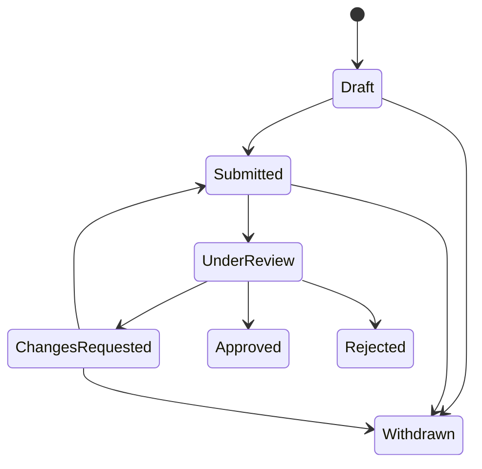

# Teacher Application State Machine

All transitions not shown above fail with `invalid_application_transition`.

| Current state | Applicant edit/demo | Submit | Start review | Decide | Withdraw |
|---|---:|---:|---:|---:|---:|
| Draft | Yes | Yes | No | No | Yes |
| Submitted | No | No | Yes | No | Yes |
| UnderReview | No | No | No | Yes | No |
| ChangesRequested | Yes | Yes | No | No | Yes |
| Approved | No | No | No | No | No |
| Rejected | No | No | No | No | No |
| Withdrawn | No | No | No | No | No |

Submission requires a complete profile, an attached demo, an active Subject, and an active Qualification Topic belonging to that Subject. Demo duration remains client-supplied metadata in this pass; it is not secure media-duration verification.

Reviewer assignment and every subsequent workflow mutation require the opaque `If-Match` application version. SQL Server rowversion detects stale writes. A stale request returns `409 concurrency_conflict`.

Only the assigned reviewer can decide. A decision supplies every one of the nine criteria exactly once, each scored 1–5. Reject and RequestChanges require a public comment; Approve may omit it. Internal notes are never included in applicant or queue DTOs. No score threshold is applied.

Approval, its immutable review and status-history row, and the subject qualification commit transactionally. A repeated terminal decision is not an idempotent success: with a stale token it returns `concurrency_conflict`; with the latest token it returns `invalid_application_transition`. It cannot add another review, history transition, or qualification.

Rejected and Withdrawn applications permit a new application. ChangesRequested remains the same active application. An existing subject qualification blocks reapplication. Approved application history is preserved; qualification revocation/expiry is a future administrative workflow and is not implemented.
