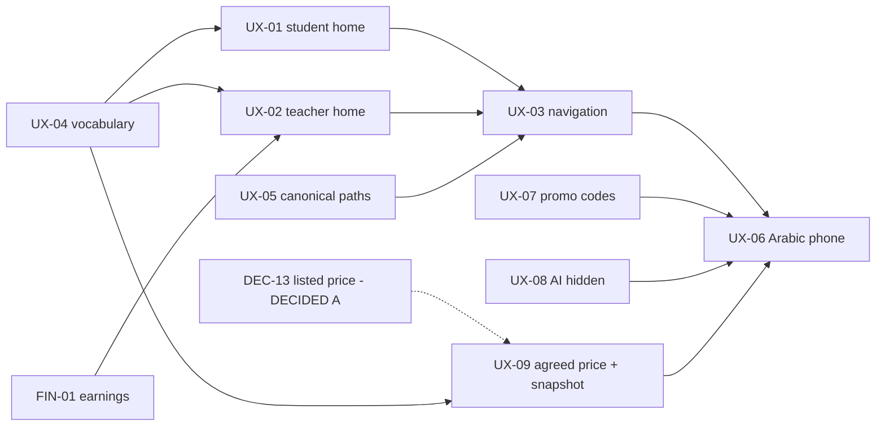

# V1 tickets — UX readiness (Release Control 3)

**Status:** Release Control 3, 2026-09-15; batch A (UX-04, UX-05) and batch B (FIN-01) built and released on 2026-09-16. Gates 1–3 written for the UX tickets and `FIN-01` using the
[ticket template](../../engineering/templates/FEATURE_TICKET.md). Documentation only — no Gate 4 work has started.
Board rules: [`SDLC.md`](../../engineering/SDLC.md) (Ready = Gates 1–3 complete; a `DECISION REQUIRED` keeps a ticket in
Backlog). Blocker list: [`V1_RELEASE_BLOCKERS.md`](../../releases/V1_RELEASE_BLOCKERS.md).

## Board

| Ticket | Title | Size | 1 Business | 2 UX | 3 Contract | Board | Waits on |
|--------|-------|------|------------|------|------------|-------|----------|
| [FIN-01](./FIN-01.md) | Teacher earnings screen | M | ✅ | ✅ | ✅ no new contract | **Done** 2026-09-16 | — |
| [UX-04](./UX-04.md) | Product statuses and fields | S | ✅ | ✅ | ✅ no new contract | **Done** 2026-09-16 | — |
| [UX-05](./UX-05.md) | Remove duplicate marketplace paths | S | ✅ | ✅ | ✅ no new contract (one server link value fixed) | **Done** 2026-09-16 | — |
| [UX-07](./UX-07.md) | Hide unusable promo codes | S | ✅ | ✅ | ✅ no new contract | **Ready** | — |
| [UX-08](./UX-08.md) | Hide AI assistant when disabled | S | ✅ | ✅ | ✅ **new** `GET /api/v1/ai/capabilities` | **Ready** | — |
| [UX-01](./UX-01.md) | Student home: action first | M | ✅ | ✅ | ✅ no new contract | **Done 2026-09-16** | — |
| [UX-02](./UX-02.md) | Teacher home: action first | M | ✅ | ✅ | ✅ no new contract | **Ready** | FIN-01, UX-04 (build) |
| [UX-03](./UX-03.md) | V1 navigation | M | ✅ | ✅ | ✅ no new contract | **Ready** | UX-01, UX-02 (+ UX-04, UX-05) |
| [UX-06](./UX-06.md) | Arabic phone verification | M | ✅ | ✅ | — | **Ready** | the other UX tickets (screens final) |
| [UX-09](./UX-09.md) | Agreed-price disclosure (incl. DEC-13 snapshot) | M | ✅ | ✅ | ✅ two nullable read fields on existing DTOs; migration | **Ready** | UX-04 (build) |

## Dependencies

## Recommended batches (WIP: one major journey or two small independent tickets)

| Batch | Tickets | Why together / why this order |
|-------|---------|-------------------------------|
| ~~**A**~~ | ~~UX-04 + UX-05~~ | **Done 2026-09-16** ([audit](../../audits/ux04-ux05-2026-09-16/README.md)): Angular 353/353, SQL Server 224/224, strict gate 217/217/0, route probe 63/63, UX-04 journey 7/7 and UX-05 journey 6/6, Waves 1, 2, 3A and 3B green |
| ~~**B**~~ | ~~FIN-01~~ | **Done 2026-09-16** ([audit](../../audits/fin01-2026-09-16/README.md)): Angular 369/369, SQL Server 225/225, strict gate 215/215/0, route probe 64/64, FIN-01 journey 7/7, UX-04 7/7, UX-05 6/6, Wave 3B direct 15/15 |
| ~~**C**~~ | ~~UX-01~~ | **Done 2026-09-16** ([audit](../../audits/ux01-2026-09-16/README.md)): Angular 389/389 in 43 files, provider-neutral 378/378, SQL Server 225/225, strict gate 218/218/0, route probe 64/64, UX-01 journey 8/8 in Arabic at 390px, UX-04 7/7, UX-05 6/6, FIN-01 7/7, Wave 3B direct 15/15 and open marketplace 9/9 |
| **D** | UX-02 | One major journey (teacher home) — after FIN-01 |
| **E** | UX-03 | Navigation over the new homes; re-runs Wave 1–3B journeys |
| **F** | UX-07 + UX-08 | Two small independent tickets; can be pulled forward into any gap (no dependencies) |
| **G** | UX-09 | One vertical slice (M, protected domain + migration); after UX-04; can move ahead of E/F if the Product Owner prefers, but alone (major journey) |
| **H** | UX-06 | Last: verifies final screens in Arabic at 390px |

The expected shape "C = UX-01 + UX-02" was evaluated and split: both are M journeys, so running them together would break
the WIP rule. UX-09 is not paired with F because it is an M slice touching protected code.

## Product question raised by RC3 — decided

**DEC-13 — Listed price reference for the agreed-price disclosure — DECIDED, Option A (2026-09-15):** an immutable server-side
snapshot of the offering price and currency on every new Direct Request, no backfill for historical requests; implemented by
UX-09 (no separate ticket). Details in [UX-09](./UX-09.md#dependencies) and
[`V1_OWNER_DECISIONS.md`](../../releases/V1_OWNER_DECISIONS.md#dec-13--listed-price-reference-for-the-agreed-price-disclosure).
