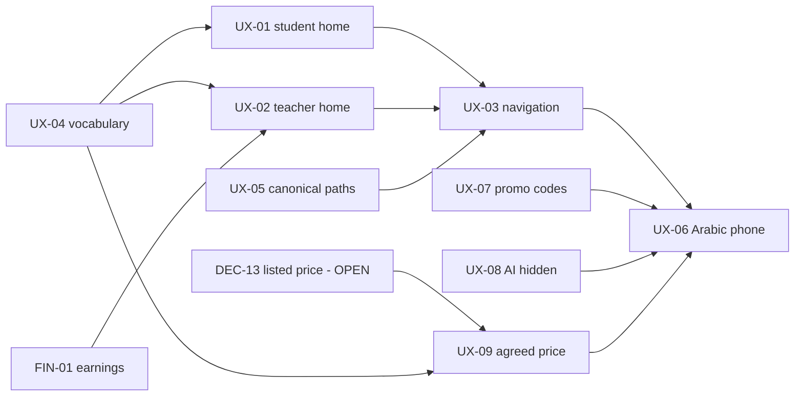

# V1 tickets — UX readiness (Release Control 3)

**Status:** Release Control 3, 2026-09-15. Gates 1–3 written for the UX tickets and `FIN-01` using the
[ticket template](../../engineering/templates/FEATURE_TICKET.md). Documentation only — no Gate 4 work has started.
Board rules: [`SDLC.md`](../../engineering/SDLC.md) (Ready = Gates 1–3 complete; a `DECISION REQUIRED` keeps a ticket in
Backlog). Blocker list: [`V1_RELEASE_BLOCKERS.md`](../../releases/V1_RELEASE_BLOCKERS.md).

## Board

| Ticket | Title | Size | 1 Business | 2 UX | 3 Contract | Board | Waits on |
|--------|-------|------|------------|------|------------|-------|----------|
| [FIN-01](./FIN-01.md) | Teacher earnings screen | M | ✅ | ✅ | ✅ no new contract | **Ready** | — |
| [UX-04](./UX-04.md) | Product statuses and fields | S | ✅ | ✅ | ✅ no new contract | **Ready** | — |
| [UX-05](./UX-05.md) | Remove duplicate marketplace paths | S | ✅ | ✅ | ✅ no new contract (one server link value fixed) | **Ready** | — |
| [UX-07](./UX-07.md) | Hide unusable promo codes | S | ✅ | ✅ | ✅ no new contract | **Ready** | — |
| [UX-08](./UX-08.md) | Hide AI assistant when disabled | S | ✅ | ✅ | ✅ **new** `GET /api/v1/ai/capabilities` | **Ready** | — |
| [UX-01](./UX-01.md) | Student home: action first | M | ✅ | ✅ | ✅ no new contract | **Ready** | UX-04 (build) |
| [UX-02](./UX-02.md) | Teacher home: action first | M | ✅ | ✅ | ✅ no new contract | **Ready** | FIN-01, UX-04 (build) |
| [UX-03](./UX-03.md) | V1 navigation | M | ✅ | ✅ | ✅ no new contract | **Ready** | UX-01, UX-02 (+ UX-04, UX-05) |
| [UX-06](./UX-06.md) | Arabic phone verification | M | ✅ | ✅ | — | **Ready** | the other UX tickets (screens final) |
| [UX-09](./UX-09.md) | Agreed-price disclosure | S (+ backend if DEC-13 = A) | ✅ | ✅ | ⛔ DEC-13 | **Backlog** | **DEC-13** (owner decision) |

## Dependencies

## Recommended batches (WIP: one major journey or two small independent tickets)

| Batch | Tickets | Why together / why this order |
|-------|---------|-------------------------------|
| **A** | UX-04 + UX-05 | Two small, independent, no contract change; UX-04 is the vocabulary every later screen uses; UX-05 removes the duplicate path before homes and navigation link to it |
| **B** | FIN-01 | One journey (teacher money view); unblocks UX-02 |
| **C** | UX-01 | One major journey (student home) |
| **D** | UX-02 | One major journey (teacher home) — after FIN-01 |
| **E** | UX-03 | Navigation over the new homes; re-runs Wave 1–3B journeys |
| **F** | UX-07 + UX-08 | Two small independent tickets; can be pulled forward into any gap (no dependencies) |
| **G** | UX-09 | Only after DEC-13 is decided |
| **H** | UX-06 | Last: verifies final screens in Arabic at 390px |

The expected shape "C = UX-01 + UX-02" was evaluated and split: both are M journeys, so running them together would break
the WIP rule. UX-09 was not paired with F because it is blocked.

## Open product question raised by RC3

**DEC-13 — Listed price reference for the agreed-price disclosure** (blocks UX-09): Teacher Offering prices are updated in
place and neither the Learning Request nor the Order stores the price the student saw, so "listed price" after acceptance
is not recoverable. Options and recommendation in [UX-09](./UX-09.md#dependencies) and
[`V1_OWNER_DECISIONS.md`](../../releases/V1_OWNER_DECISIONS.md#dec-13--listed-price-reference-for-the-agreed-price-disclosure).
